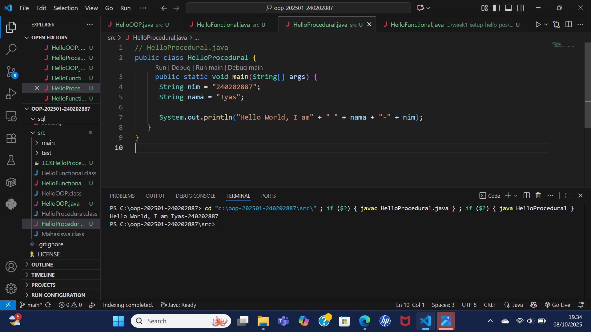
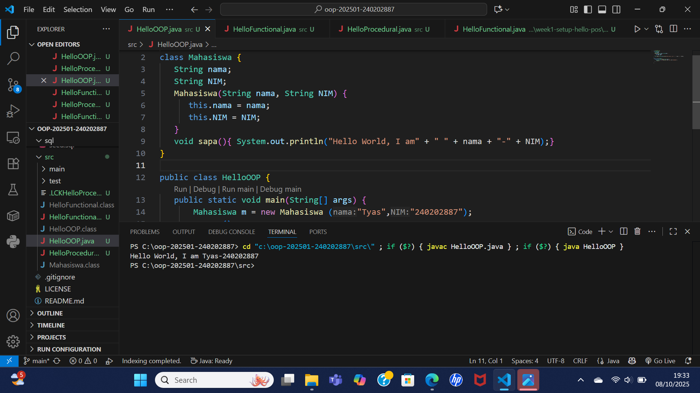
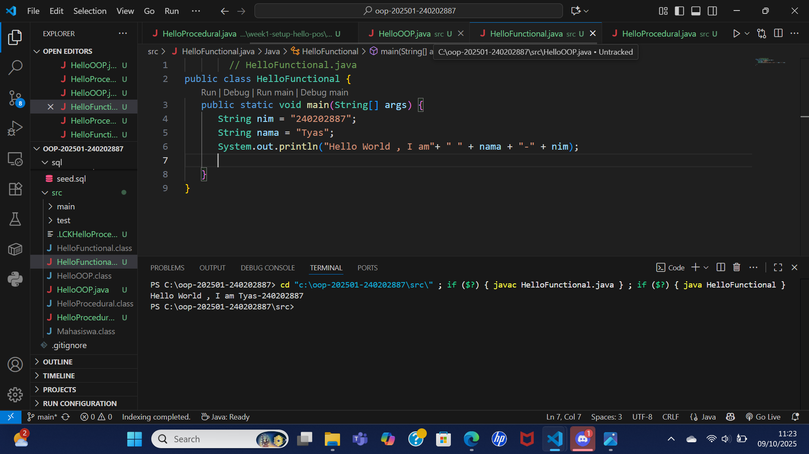

# Laporan Praktikum Minggu 1 
Topik: Pengenalan Paradigma dan Setup Proyek

## Identitas
- Nama  : Tyas Nurshika Damaia
- NIM   : 240202887
- Kelas : 3IKRB

---

## Tujuan
- Mahasiswa mampu mendefinisikan paradigma prosedural, OOP, dan fungsional.
- Mahasiswa mampu membandingkan kelebihan dan keterbatasan tiap paradigma.
- Mahasiswa mampu memberikan contoh program sederhana untuk masing-masing paradigma.
- Mahasiswa aktif dalam diskusi kelas (bertanya, menjawab, memberi opini).

---

## Dasar Teori
Paradigma pemrograman adalah cara pandang dalam menyusun program:

- Prosedural: program dibangun sebagai rangkaian perintah (fungsi/prosedur).
- OOP (Object-Oriented Programming): program dibangun dari objek yang memiliki data (atribut) dan perilaku (method).
- Fungsional: program dipandang sebagai pemetaan fungsi matematika, lebih menekankan ekspresi dan transformasi data.
Dalam konteks Agri-POS, OOP membantu memodelkan entitas nyata seperti Produk, Transaksi, dan Pembayaran sebagai objek. Dengan demikian, sistem lebih mudah dikembangkan dan dipelihara.


---

## Langkah Praktikum
1. Setup Project

- Pastikan sudah menginstall JDK (Java Development Kit), IDE (misal: IntelliJ IDEA, VS Code, NetBeans), Git, PostgreSQL, dan JavaFX di komputer.
- Buat folder project oop-pos-<nim>.
- Inisialisasi repositori Git.
- Buat struktur awal src/main/java/com/upb/agripos/.
- Pastikan semua tools dapat berjalan (uji dengan membuat dan menjalankan program Java sederhana).

2. Program Sederhana dalam 3 Paradigma

- Prosedural: program untuk menghitung total harga dua produk.
- OOP: class Produk dengan atribut nama dan harga, buat minimal tiga objek, lalu hitung total.
- Fungsional: gunakan Stream atau lambda untuk menghitung total harga dari minimal tiga objek.

3. Commit dan Push

- Commit dengan pesan: week1-setup-hello-pos.

---

## Kode Program

1. Procedural

```java
// HelloProcedural.java
public class HelloProcedural {
     public static void main(String[] args) {
      String nim = "240202887";
      String nama = "Tyas";
      
      System.out.println("Hello World, I am" + " " + nama + "-" + nim);
   }
}
```

2. OOP

```java
 // HelloOOP.java
class Mahasiswa {
   String nama;
   String NIM;
   Mahasiswa(String nama, String NIM) {
      this.nama = nama;
      this.NIM = NIM;
   }
   void sapa(){ System.out.println("Hello World, I am" + " " + nama + "-" + NIM);}
}

public class HelloOOP {
   public static void main(String[] args) {
       Mahasiswa m = new Mahasiswa ("Tyas","240202887");
       m.sapa();
   }

}
```

3. Functional

```java
        // HelloFunctional.java
public class HelloFunctional {
   public static void main(String[] args) {
      String nim = "240202887";
      String nama = "Tyas"; 
      System.out.println("Hello World , I am"+ " " + nama + "-" + nim);
      
   }
}
```

---

## Hasil Eksekusi 




---

## Analisis

- Jelaskan bagaimana kode berjalan.
 Procedural

a. Program Java selalu dimulai dari metode main().
b. Dua variabel dibuat:
- nim menyimpan "240202887"
- nama menyimpan "Tyas"
c. Baris System.out.println(...) mencetak teks ke layar.
d. Output yang dihasilkan adalah:

Hello World, I am Tyas-240202887

Functional

a. Program tetap dimulai dari metode main().
b. Di dalamnya terdapat dua variabel nama dan nim seperti pada versi prosedural.
c. Fungsi utama hanya fokus menghasilkan output dari input tanpa membuat objek.
d. Baris System.out.println(...) mencetak hasil:


Hello World, I am Tyas-240202887


OOP (Object-Oriented Programming)

a. Program tetap dimulai dari main() di kelas HelloOOP.
b. Baris
Mahasiswa m = new Mahasiswa("Tyas", "240202887");

membuat objek baru dari kelas Mahasiswa. Konstruktor Mahasiswa(...) dijalankan untuk mengisi nilai nama dan NIM.
c. Baris m.sapa(); memanggil metode sapa() dari objek m, yang mencetak:

Hello World, I am Tyas-240202887

- Kendala yang dihadapi dan cara mengatasinya
Kendala yang muncul adalah error saat menjalankan program, biasanya karena menekan Run Code bukan Start Debugging, atau karena typo kecil seperti lupa tanda ; atau tanda kutip " ".
Cara mengatasinya adalah menjalankan program lewat Start Debugging, serta mengecek error di bawah garis merah di VSCode sebelum dijalankan.
---

## Kesimpulan
Dari praktikum ini, dapat disimpulkan bahwa setiap paradigma pemrograman memiliki karakteristik dan cara kerja yang berbeda.
Paradigma prosedural mengeksekusi langkah-langkah secara berurutan di dalam satu metode utama, fungsional menekankan pada fungsi yang menghasilkan output tanpa mengubah data secara langsung, sedangkan OOP (Object-Oriented Programming) menggunakan konsep class dan object untuk memisahkan data serta perilakunya agar program lebih terstruktur dan mudah dikembangkan.

---

## Quiz
1. **Apakah OOP selalu lebih baik dari prosedural?**
   
   **Jawaban:** OOP tidak selalu lebih baik dari prosedural. Keduanya memiliki keunggulan sesuai kebutuhan. OOP lebih cocok untuk program besar yang membutuhkan struktur jelas, pemeliharaan mudah, dan penggunaan ulang kode. Sedangkan prosedural lebih efisien untuk program kecil yang sederhana dan cepat dijalankan. Jadi, pemilihan paradigma tergantung pada tujuan serta kompleksitas program yang dibuat.

2.  **Kapan functional programming lebih cocok digunakan dibanding OOP atau prosedural?**
   
   **Jawaban:** Functional programming lebih cocok digunakan ketika program berfokus pada pengolahan data, perhitungan matematis, atau transformasi input menjadi output tanpa perlu menyimpan atau mengubah keadaan (state). Paradigma ini ideal untuk kasus yang membutuhkan kode singkat, bersih, dan mudah diuji, seperti pada analisis data, kecerdasan buatan, pengolahan paralel, atau program dengan banyak operasi berulang.
Singkatnya, functional lebih tepat digunakan saat kita ingin menulis program yang declarative, bebas efek samping, dan efisien dalam proses data. Contohnya analisis data atau perhitungan matematis,pemrosesan paralel (multi-core),Transformasi data (filter dan mapping)dll.

3. **Bagaimana paradigma (prosedural, OOP, fungsional) memengaruhi maintainability dan scalability aplikasi?**
   
   **Jawaban:**
 - Prosedural
Paradigma ini cocok untuk program kecil karena strukturnya sederhana. Namun, ketika aplikasi tumbuh besar, kode menjadi sulit dikelola — logika bercampur di satu tempat, sehingga sulit memperbaiki bug atau menambah fitur.
Maintainability dan scalability rendah.

- OOP (Object-Oriented Programming)
OOP membagi program ke dalam class dan object, sehingga kode lebih terstruktur, modular, dan mudah diperbarui tanpa mengganggu bagian lain. Konsep seperti inheritance dan encapsulation membuat pengembangan besar lebih mudah.
Maintainability dan scalability tinggi.

- Fungsional
Functional programming fokus pada fungsi murni tanpa efek samping. Ini membuat kode mudah diuji, diubah, dan di-parallel-kan, sehingga sangat baik untuk sistem besar yang memproses banyak data.
Maintainability tinggi, scalability juga sangat baik untuk aplikasi berbasis data.

4. **Mengapa OOP lebih cocok untuk mengembangkan aplikasi POS dibanding prosedural?**
   
**Jawaban:** OOP lebih cocok untuk aplikasi POS karena mampu memodelkan entitas nyata seperti produk, pelanggan, dan transaksi ke dalam class yang terpisah dengan data dan perilakunya masing-masing. Hal ini membuat kode lebih terstruktur, mudah dikembangkan, serta dapat digunakan kembali. Dibandingkan prosedural yang cenderung membuat logika bercampur dalam satu alur, OOP memberikan kemudahan dalam pemeliharaan dan perluasan sistem secara berkelanjutan.

5. **Bagaimana paradigma fungsional dapat membantu mengurangi kode berulang (boilerplate code)?**
   
**Jawaban:** Paradigma fungsional membantu mengurangi kode berulang karena kita bisa memakai fungsi-fungsi sederhana seperti map(), filter(), atau reduce() untuk melakukan banyak hal tanpa menulis perulangan yang sama terus-menerus. Jadi, kita cukup menulis apa yang ingin dilakukan, bukan langkah-langkah detailnya. Hasilnya, kode jadi lebih singkat, rapi, dan gampang dibaca.
