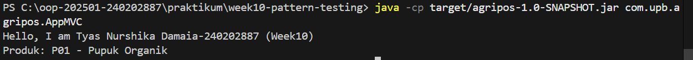
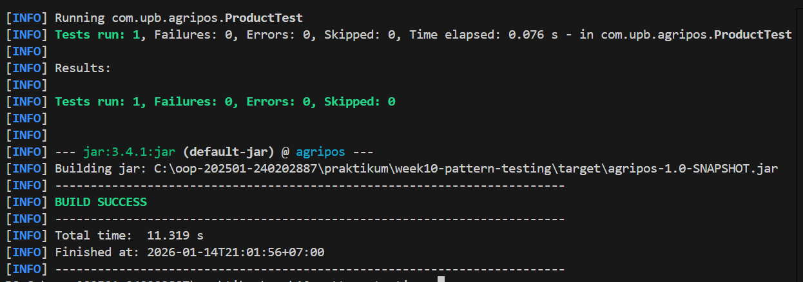

# Laporan Praktikum Minggu 10
Topik: Design Pattern (Singleton, MVC) dan Unit Testing menggunakan JUnit

## Identitas
- Nama  : Tyas Nurshika Damaia
- NIM   : 240202887
- Kelas : 3IKRB

---

## Tujuan
Setelah mengikuti praktikum ini, mahasiswa mampu:

1. Menjelaskan konsep dasar design pattern dalam rekayasa perangkat lunak.
2. Mengimplementasikan Singleton Pattern dengan benar.
3. Menjelaskan dan menerapkan Model–View–Controller (MVC) pada aplikasi sederhana.
4. Membuat dan menjalankan unit test menggunakan JUnit.
5. Menganalisis manfaat penerapan design pattern dan unit testing terhadap kualitas perangkat lunak.


---

## Dasar Teori
1. Design Pattern

Design pattern merupakan solusi umum yang telah terbukti efektif untuk menyelesaikan permasalahan berulang dalam perancangan perangkat lunak. Konsep ini bertujuan meningkatkan kualitas desain, keterbacaan kode, kemudahan pemeliharaan, serta fleksibilitas pengembangan aplikasi. Design pattern membantu pengembang menggunakan pendekatan yang terstruktur dan konsisten dalam membangun sistem perangkat lunak.

2. Singleton Pattern

Singleton Pattern adalah salah satu creational design pattern yang bertujuan untuk memastikan bahwa sebuah class hanya memiliki satu instance selama aplikasi berjalan dan menyediakan akses global ke instance tersebut. Pola ini sering digunakan pada objek yang bersifat global seperti konfigurasi sistem atau koneksi database untuk mencegah pemborosan sumber daya dan inkonsistensi data.

3. Model–View–Controller (MVC)

MVC merupakan pola arsitektur perangkat lunak yang membagi aplikasi menjadi tiga komponen utama, yaitu Model, View, dan Controller. Pemisahan ini bertujuan untuk memisahkan logika bisnis, tampilan, dan alur kontrol aplikasi sehingga kode menjadi lebih terstruktur, mudah dikembangkan, dan mudah diuji.

4. Unit Testing dan JUnit

Unit testing adalah proses pengujian perangkat lunak pada unit terkecil dari program, seperti method atau class, untuk memastikan bahwa setiap unit berjalan sesuai dengan yang diharapkan. JUnit merupakan framework pengujian unit untuk bahasa pemrograman Java yang digunakan untuk menulis dan menjalankan pengujian secara otomatis. Penerapan unit testing membantu mendeteksi kesalahan sejak dini dan meningkatkan kualitas serta keandalan perangkat lunak.

---

## Langkah Praktikum

1. Membuat project Maven dan menyiapkan struktur direktori sesuai standar Maven.
2. Mengimplementasikan Singleton Pattern pada class DatabaseConnection dengan constructor private dan method getInstance().
3. Menerapkan arsitektur MVC dengan membuat:
- Model Product
- View ConsoleView
- Controller ProductController
4. Mengintegrasikan Model, View, dan Controller pada class AppMVC sebagai program utama.
5. Membuat unit test menggunakan JUnit pada class ProductTest.
6. Menjalankan unit test menggunakan perintah Maven dan memastikan tidak ada error.
7. Melakukan build project hingga muncul status BUILD SUCCESS.
8. Mendokumentasikan hasil pengujian (screenshot) dan menyusun laporan praktikum.
9. Melakukan commit dan push kode sesuai instruksi pengumpulan.

---

## Kode Program
1️⃣ Singleton – DatabaseConnection.java
```java
 package com.upb.agripos.config;

public class DatabaseConnection {
    private static DatabaseConnection instance;

    private DatabaseConnection() {}

    public static DatabaseConnection getInstance() {
        if (instance == null) {
            instance = new DatabaseConnection();
        }
        return instance;
    }
}
```

2️⃣ Model – Product.java
```java
package com.upb.agripos.model;

public class Product {
    private final String code;
    private final String name;

    public Product(String code, String name) {
        this.code = code;
        this.name = name;
    }

    public String getCode() {
        return code;
    }

    public String getName() {
        return name;
    }
}
```

3️⃣ View – ConsoleView.java
```java
package com.upb.agripos.view;

public class ConsoleView {
    public void showMessage(String message) {
        System.out.println(message);
    }
}
```

4️⃣ Controller – ProductController.java
```java
package com.upb.agripos.controller;

import com.upb.agripos.model.Product;
import com.upb.agripos.view.ConsoleView;

public class ProductController {
    private final Product model;
    private final ConsoleView view;

    public ProductController(Product model, ConsoleView view) {
        this.model = model;
        this.view = view;
    }

    public void showProduct() {
        view.showMessage("Produk: " + model.getCode() + " - " + model.getName());
    }
}
```

5️⃣ Main Program (MVC Jalan) – AppMVC.java
```java
package com.upb.agripos;

import com.upb.agripos.model.Product;
import com.upb.agripos.view.ConsoleView;
import com.upb.agripos.controller.ProductController;

public class AppMVC {
    public static void main(String[] args) {
        System.out.println("Hello, I am Tyas Nurshika Damaia-240202887 (Week10)");

        Product product = new Product("P01", "Pupuk Organik");
        ConsoleView view = new ConsoleView();
        ProductController controller = new ProductController(product, view);

        controller.showProduct();
    }
}
```


Output yang muncul:

```bash
Hello, I am Tyas Nurshika Damaia-240202887 (Week10)
Produk: P01 - Pupuk Organik
```

6️⃣ Unit Test JUnit – ProductTest.java
```java
package com.upb.agripos;

import static org.junit.jupiter.api.Assertions.assertEquals;
import org.junit.jupiter.api.Test;
import com.upb.agripos.model.Product;

public class ProductTest {

    @Test
    public void testProductName() {
        Product p = new Product("P01", "Pupuk Organik");
        assertEquals("Pupuk Organik", p.getName());
    }
}
```

7️⃣ Perintah Menjalankan

Jalankan di folder yang ada pom.xml:

```bash
mvn clean test
```

---

## Hasil Eksekusi
 1. ouput AppMVC


2. Junit


---

## Analisis

- Jelaskan bagaimana kode berjalan.

1. Program dijalankan melalui class AppMVC sebagai main program.
2. Di dalam main, dibuat objek Product sebagai Model yang menyimpan data produk.
3. ConsoleView dibuat sebagai View untuk menampilkan output ke layar.
4. ProductController menghubungkan Model dan View.
5. Controller mengambil data dari Model lalu meneruskannya ke View.
6. View menampilkan informasi produk ke console.
7. Program menghasilkan output berupa data produk sesuai pola MVC.

- Apa perbedaan pendekatan minggu ini dibanding minggu sebelumnya.
1. Penerapan Design Pattern secara nyata
   Pada minggu ini tidak hanya mempelajari teori, tetapi langsung mengimplementasikan Singleton Pattern dan MVC ke dalam kode program nyata.
2. Pemisahan tanggung jawab kode (MVC)
   Kode program menjadi lebih rapi dan terstruktur karena logika data (Model), tampilan (View), dan pengendali alur (Controller) dipisahkan dengan jelas.
3. Penggunaan Maven sebagai build tool
   Proses compile, testing, dan build dilakukan secara otomatis menggunakan Maven, bukan lagi dijalankan manual satu per satu.
4. Pengenalan Unit Testing dengan JUnit
   Ini menjadi pertama kalinya program diuji menggunakan JUnit, sehingga kode tidak hanya berjalan, tetapi juga divalidasi kebenarannya.
5. Fokus pada kualitas dan maintainability kode
   Minggu ini menekankan bahwa program yang baik bukan hanya menghasilkan output, tetapi juga mudah diuji, dikembangkan, dan dipelihara.  

- Kendala yang dihadapi dan cara mengatasinya.  

Kendala Download dan Instalasi Maven

1. Perintah mvn tidak dikenali
   Terjadi karena Maven belum ditambahkan ke Environment Variable (PATH) sehingga sistem tidak bisa mengenali perintah mvn.
2. Folder Maven tidak sesuai
   Maven dijalankan bukan dari folder project yang berisi file pom.xml, menyebabkan error MissingProjectException.
3. Ekstraksi file Maven tidak benar
   File .zip Maven belum diekstrak dengan benar atau folder yang dipilih salah (harus ke folder apache-maven-x.x.x).
4. Konfigurasi MAVEN_HOME belum benar
   Variabel lingkungan MAVEN_HOME belum mengarah ke direktori utama Maven.
5. Perbedaan PowerShell dan CMD
   Setelah mengatur PATH, terminal belum direstart sehingga konfigurasi belum terbaca.

---

## Kesimpulan
Pada praktikum Week 10 ini, mahasiswa mempelajari dan menerapkan design pattern Singleton dan arsitektur MVC serta unit testing menggunakan JUnit. Penerapan design pattern membantu menghasilkan struktur kode yang lebih rapi, terorganisir, dan mudah dikembangkan, sementara penggunaan unit testing memastikan program berjalan sesuai dengan yang diharapkan. Selain itu, penggunaan Maven sebagai build tool mempermudah proses pengelolaan dependensi, pengujian, dan build aplikasi, sehingga meningkatkan kualitas dan keandalan perangkat lunak secara keseluruhan.
---

## Quiz
1. Mengapa constructor pada Singleton harus bersifat private? 
   **Jawaban:** Constructor dibuat private agar objek tidak dapat dibuat secara langsung dari luar class, sehingga jumlah instance tetap satu dan sesuai dengan konsep Singleton.
2. Jelaskan manfaat pemisahan Model, View, dan Controller.
   **Jawaban:** Pemisahan Model, View, dan Controller membuat kode lebih terstruktur, mudah dipahami, mudah dikembangkan, serta memudahkan proses perawatan dan pengujian aplikasi. 

3. Apa peran unit testing dalam menjaga kualitas perangkat lunak?
   **Jawaban:** Unit testing berperan untuk memastikan setiap bagian kode berjalan sesuai fungsinya, mendeteksi kesalahan sejak dini, dan meningkatkan keandalan serta kualitas perangkat lunak. 

4. Apa risiko jika Singleton tidak diimplementasikan dengan benar?
   **Jawaban:** Jika Singleton tidak diimplementasikan dengan benar, dapat terjadi pembuatan lebih dari satu instance yang menyebabkan pemborosan sumber daya, inkonsistensi data, dan kesalahan logika program.