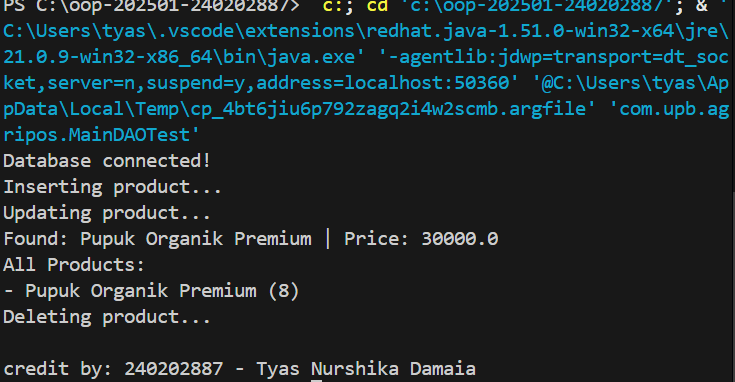

# Laporan Praktikum Minggu 11
Topik: Data Access Object (DAO) dan CRUD Database dengan JDBC

## Identitas
- Nama  : Tyas Nurshika Damaia
- NIM   : 240202887
- Kelas : 3IKRB

---

## Tujuan


1. Menjelaskan konsep Data Access Object (DAO) dalam pengembangan aplikasi OOP.
2. Menghubungkan aplikasi Java dengan basis data menggunakan JDBC.
3. Mengimplementasikan operasi CRUD (Create, Read, Update, Delete) secara lengkap.
4. Mengintegrasikan DAO dengan class aplikasi OOP sesuai prinsip desain yang baik.

---

## Dasar Teori
### 1. Konsep Data Access Object (DAO)

DAO adalah pola desain yang memisahkan logika akses data dari logika bisnis aplikasi. Dengan DAO, perubahan teknologi basis data tidak memengaruhi logika utama aplikasi.

Manfaat DAO:
- Kode lebih terstruktur dan mudah dipelihara
- Mengurangi tight coupling antara aplikasi dan database
- Mendukung pengujian dan pengembangan lanjutan

---

### 2. JDBC dan Koneksi Database

JDBC (Java Database Connectivity) digunakan untuk menghubungkan aplikasi Java dengan basis data relasional, dalam praktikum ini menggunakan PostgreSQL.

Komponen utama JDBC:
- DriverManager
- Connection
- PreparedStatement
- ResultSet

---

## Langkah Praktikum

1. Menyiapkan lingkungan pengembangan dengan memastikan JDK, Maven, dan PostgreSQL telah terinstal dan berjalan dengan baik.
2. Membuat database PostgreSQL dengan nama agripos dan membuat tabel products sesuai struktur yang ditentukan.
3. Membuat proyek Java menggunakan struktur Maven pada folder week11-dao-database.
4. Mengonfigurasi file pom.xml dengan menambahkan dependency PostgreSQL JDBC Driver.
5. Membuat class model Product pada package com.upb.agripos.model sebagai representasi tabel products.
6. Membuat interface ProductDAO pada package com.upb.agripos.dao yang berisi method CRUD.
7. Mengimplementasikan interface ProductDAO pada class ProductDAOImpl menggunakan JDBC dan PreparedStatement.
8. Membuat class MainDAOTest untuk menguji operasi CRUD melalui DAO tanpa menuliskan SQL langsung di main().
9. Menjalankan aplikasi dan memastikan seluruh operasi CRUD (insert, select, update, delete) berjalan dengan baik.
10. Mengambil screenshot hasil eksekusi program dan menyimpannya pada folder screenshots.
11. Menyusun laporan praktikum Bab 11 dan melakukan commit sesuai ketentuan.

---

## Kode Program
 
1. ProductDAO

```java
package com.upb.agripos.dao;

import java.util.List;
import com.upb.agripos.model.Product;

public interface ProductDAO {
    void insert(Product product) throws Exception;
    Product findByCode(String code) throws Exception;
    List<Product> findAll() throws Exception;
    void update(Product product) throws Exception;
    void delete(String code) throws Exception;
}
```

2. ProductDAOlmpl

```java
package com.upb.agripos.dao;

import java.sql.*;
import java.util.ArrayList;
import java.util.List;
import com.upb.agripos.model.Product;

public class ProductDAOImpl implements ProductDAO {

    private final Connection connection;

    public ProductDAOImpl(Connection connection) {
        this.connection = connection;
    }

    @Override
    public void insert(Product p) throws Exception {
        String sql = "INSERT INTO products(code, name, price, stock) VALUES (?, ?, ?, ?)";
        try (PreparedStatement ps = connection.prepareStatement(sql)) {
            ps.setString(1, p.getCode());
            ps.setString(2, p.getName());
            ps.setDouble(3, p.getPrice());
            ps.setInt(4, p.getStock());
            ps.executeUpdate();
        }
    }

    @Override
    public Product findByCode(String code) throws Exception {
        String sql = "SELECT * FROM products WHERE code = ?";
        try (PreparedStatement ps = connection.prepareStatement(sql)) {
            ps.setString(1, code);
            try (ResultSet rs = ps.executeQuery()) {
                if (rs.next()) {
                    return new Product(
                        rs.getString("code"),
                        rs.getString("name"),
                        rs.getDouble("price"),
                        rs.getInt("stock")
                    );
                }
            }
        }
        return null;
    }

    @Override
    public List<Product> findAll() throws Exception {
        List<Product> list = new ArrayList<>();
        String sql = "SELECT * FROM products";
        try (PreparedStatement ps = connection.prepareStatement(sql);
             ResultSet rs = ps.executeQuery()) {
            while (rs.next()) {
                list.add(new Product(
                    rs.getString("code"),
                    rs.getString("name"),
                    rs.getDouble("price"),
                    rs.getInt("stock")
                ));
            }
        }
        return list;
    }

    @Override
    public void update(Product p) throws Exception {
        String sql = "UPDATE products SET name=?, price=?, stock=? WHERE code=?";
        try (PreparedStatement ps = connection.prepareStatement(sql)) {
            ps.setString(1, p.getName());
            ps.setDouble(2, p.getPrice());
            ps.setInt(3, p.getStock());
            ps.setString(4, p.getCode());
            ps.executeUpdate();
        }
    }

    @Override
    public void delete(String code) throws Exception {
        String sql = "DELETE FROM products WHERE code=?";
        try (PreparedStatement ps = connection.prepareStatement(sql)) {
            ps.setString(1, code);
            ps.executeUpdate();
        }
    }
}
```

3. Product

```java
package com.upb.agripos.model;

public class Product {
    private String code;
    private String name;
    private double price;
    private int stock;

    public Product(String code, String name, double price, int stock) {
        this.code = code;
        this.name = name;
        this.price = price;
        this.stock = stock;
    }

    public String getCode() { return code; }
    public String getName() { return name; }
    public double getPrice() { return price; }
    public int getStock() { return stock; }

    public void setName(String name) { this.name = name; }
    public void setPrice(double price) { this.price = price; }
    public void setStock(int stock) { this.stock = stock; }
}
```

4. MainDAOTest

```java
package com.upb.agripos;

import java.sql.Connection;
import java.sql.DriverManager;
import java.util.List;

import com.upb.agripos.dao.ProductDAO;
import com.upb.agripos.dao.ProductDAOImpl;
import com.upb.agripos.model.Product;

public class MainDAOTest {
    public static void main(String[] args) throws Exception {

        Connection conn = DriverManager.getConnection(
            "jdbc:postgresql://localhost:5432/agripos",
            "postgres",
            "tyasnd77"
        );
        System.out.println("Database connected!");

        ProductDAO dao = new ProductDAOImpl(conn);

        System.out.println("Inserting product...");
        dao.insert(new Product("P01", "Pupuk Organik", 25000, 10));

        System.out.println("Updating product...");
        dao.update(new Product("P01", "Pupuk Organik Premium", 30000, 8));

        Product p = dao.findByCode("P01");
        System.out.println("Found: " + p.getName() + " | Price: " + p.getPrice());

        System.out.println("All Products:");
        List<Product> products = dao.findAll();
        for (Product pr : products) {
            System.out.println("- " + pr.getName() + " (" + pr.getStock() + ")");
        }

        System.out.println("Deleting product...");
        dao.delete("P01");

        // ✅ IDENTITAS DI AKHIR
        System.out.println();
        System.out.println("credit by: 240202887 - Tyas Nurshika Damaia");

        conn.close();
    }
}
```


---

## Hasil Eksekusi
(Sertakan screenshot hasil eksekusi program.  

)
---

## Analisis

Cara kerja kode:
Program menggunakan pola DAO untuk memisahkan logika bisnis dan akses database. Class MainDAOTest membuat koneksi ke PostgreSQL, lalu memanggil method CRUD melalui ProductDAO. Setiap operasi (insert, update, select, delete) dijalankan menggunakan JDBC dengan PreparedStatement sehingga data dapat tersimpan, diambil, diubah, dan dihapus dari database.

Perbedaan dengan minggu sebelumnya:
Pada minggu sebelumnya aplikasi hanya berjalan di level OOP tanpa database. Minggu ini kode sudah terhubung ke database menggunakan JDBC dan DAO sehingga data bersifat permanen dan tidak hanya tersimpan di memori.

Kendala dan solusi:
Kendala yang sering muncul adalah error koneksi database dan konfigurasi dependency Maven. Masalah diatasi dengan memastikan PostgreSQL berjalan, URL koneksi benar, serta dependency JDBC sudah ditambahkan dan berhasil diunduh oleh Maven.
---

## Kesimpulan
Pada praktikum Week 11, penerapan Data Access Object (DAO) dan JDBC berhasil menghubungkan aplikasi Java dengan database PostgreSQL. Pola DAO membantu memisahkan logika akses data dari logika aplikasi sehingga kode lebih terstruktur, mudah dipelihara, dan sesuai prinsip OOP. Operasi CRUD dapat dijalankan dengan baik menggunakan PreparedStatement, sehingga aplikasi mampu mengelola data produk secara permanen dan lebih siap dikembangkan ke tahap integrasi selanjutnya.

---
