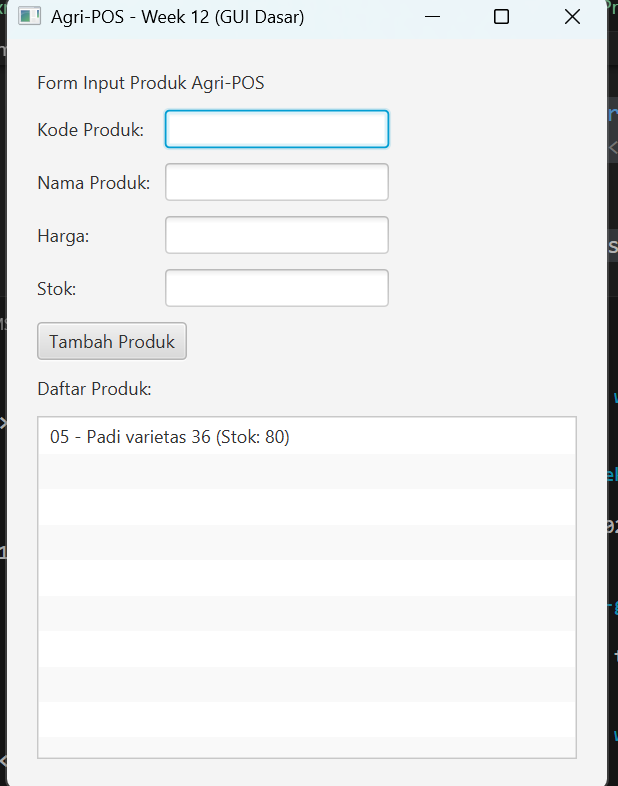

# Laporan Praktikum Minggu 12
Topik: GUI Dasar JavaFX (Event-Driven Programming)


## Identitas
- Nama  : Tyas Nurshika Damaia
- NIM   : 240202887
- Kelas : 3IKRB

---

## Tujuan

1. Menjelaskan konsep event-driven programming.
2. Membangun antarmuka grafis sederhana menggunakan JavaFX.
3. Membuat form input data produk.
4. Menampilkan daftar produk pada GUI.
5. Mengintegrasikan GUI dengan modul backend yang telah dibuat (DAO & Service).


---

## Dasar Teori

1. Object Oriented Programming (OOP)
   OOP adalah paradigma pemrograman berbasis objek yang menerapkan konsep enkapsulasi, pewarisan, dan polimorfisme untuk membuat kode lebih terstruktur dan mudah dikembangkan.
2. Model View Controller (MVC)
   MVC memisahkan aplikasi menjadi Model, View, dan Controller agar logika bisnis, tampilan, dan alur kontrol tidak saling bergantung.
3. Data Access Object (DAO)
   DAO digunakan untuk memisahkan logika akses database dari logika aplikasi sehingga kode lebih rapi dan mudah dipelihara.
4. Java Database Connectivity (JDBC)
   JDBC merupakan API Java untuk menghubungkan aplikasi dengan database relasional dan menjalankan perintah SQL.
5. JavaFX
   JavaFX adalah framework Java untuk membangun antarmuka grafis (GUI) yang terintegrasi dengan arsitektur MVC.
6. Collections Framework
   Collections digunakan untuk mengelola kumpulan data seperti keranjang belanja secara efisien.
7. Exception Handling dan Unit Testing
   Exception handling digunakan untuk menangani kesalahan program, sedangkan unit testing memastikan logika aplikasi berjalan dengan benar.

---

## Langkah Praktikum
1. Membuat struktur project Maven sesuai standar (model, dao, service, controller, view).
2. Membuat database PostgreSQL dan tabel products sesuai spesifikasi.
3. Membuat class Product sebagai model data produk.
4. Membuat interface ProductDAO untuk mendefinisikan operasi CRUD.
5. Mengimplementasikan ProductDAOImpl menggunakan JDBC dan PreparedStatement.
6. Membuat ProductService sebagai penghubung antara controller dan DAO.
7. Mengintegrasikan DAO dan service pada class utama untuk pengujian CRUD.
8. Menjalankan perintah Maven (mvn clean compile dan mvn exec:java) untuk memastikan program berjalan.
9. Mengambil screenshot hasil eksekusi CRUD sebagai bukti keberhasilan.
10. Menyusun laporan praktikum dan melakukan commit ke repository sesuai ketentuan

---

## Kode Program

## Contoh Event Handling JavaFX
```java
btnAdd.setOnAction(event -> {
	 Product p = new Product(
		  txtCode.getText(),
		  txtName.getText(),
		  Double.parseDouble(txtPrice.getText()),
		  Integer.parseInt(txtStock.getText())
	 );
	 productService.insert(p); // productService mengarah ke DAO
	 listView.getItems().add(p.getCode() + " - " + p.getName());
});
```
---

## Hasil Eksekusi
(Sertakan screenshot hasil eksekusi program.  

)
---

## Analisis

- Peralihan dari program berbasis console ke GUI (visual & interaktif).
- Konsep event-driven programming mulai dipakai (aksi tombol, input user).
- GUI tidak boleh berisi logika CRUD, hanya memicu event dan menampilkan data.
- Terjadi integrasi nyata antara frontend (JavaFX) dan backend (Service + DAO).
- Penerapan MVC + SOLID (DIP) terlihat jelas: View → Controller → Service → DAO.

---

## Kesimpulan
JavaFX digunakan untuk membangun antarmuka grafis berbasis event-driven yang terintegrasi dengan backend aplikasi. GUI berperan sebagai View yang hanya menangani input dan tampilan, sedangkan proses bisnis dan akses database tetap dikelola oleh Controller, Service, dan DAO. Dengan pendekatan ini, struktur aplikasi menjadi lebih rapi, terpisah dengan jelas, dan konsisten dengan konsep MVC, SOLID, serta desain UML yang telah dibuat pada pertemuan sebelumnya.

---

| Artefak Bab 6 | Referensi                    | Handler GUI              | Controller/Service                                               | DAO                   | Dampak UI/DB                                                   |
| ------------- | ---------------------------- | ------------------------ | ---------------------------------------------------------------- | --------------------- | -------------------------------------------------------------- |
| Use Case      | UC-01 Kelola Produk (Tambah) | Tombol **Tambah Produk** | `ProductController.addProduct()` → `ProductService.addProduct()` | `ProductDAO.insert()` | Data produk tersimpan dan daftar produk di GUI bertambah       |
| Activity      | AD-01 Tambah Produk          | Tombol **Tambah Produk** | `addProduct()` (validasi input → simpan data)                    | `insert()`            | Input tervalidasi, data disimpan, tampilan diperbarui          |
| Sequence      | SD-01 Tambah Produk          | Tombol **Tambah Produk** | View → Controller → Service                                      | DAO → Database        | Alur pemanggilan sesuai sequence diagram, UI menampilkan hasil |

---