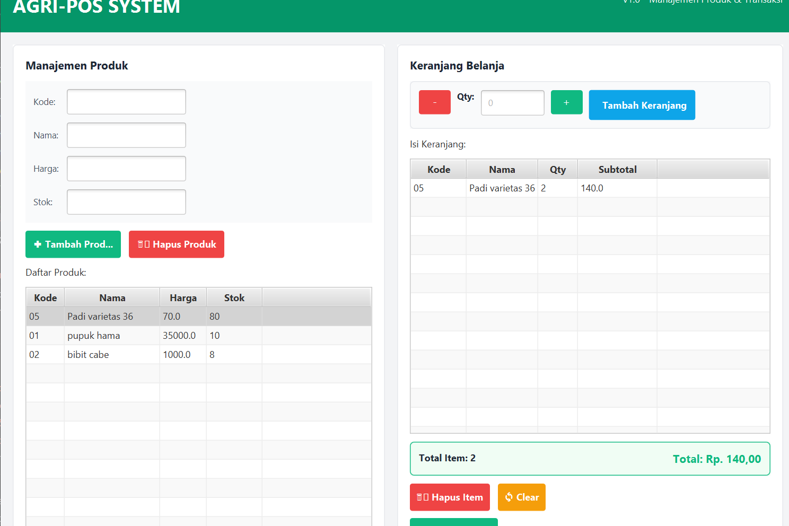

# Laporan Praktikum Minggu 14
Topik: Integrasi Individu (OOP + Database + GUI)

## Identitas
- Nama  : Tyas Nurshika Damaia
- NIM   : 240202887
- Kelas : 3IKRB

---

## Tujuan
1. Mengintegrasikan konsep OOP (Bab 1–5) ke dalam satu aplikasi yang utuh.
2. Mengimplementasikan rancangan UML + SOLID (Bab 6) menjadi kode nyata.
3. Mengintegrasikan Collections + Keranjang (Bab 7) ke alur aplikasi.
4. Menerapkan exception handling (Bab 9) untuk validasi dan error flow.
5. Menerapkan pattern + unit testing (Bab 10) pada bagian yang relevan.
6. Menghubungkan aplikasi dengan database via DAO + JDBC (Bab 11).
7. Menyajikan aplikasi berbasis JavaFX (Bab 12–13) yang terhubung ke backend.

---

## Dasar Teori
### A. Produk (Bab 2, 5, 11, 12, 13)
- Tampilkan daftar produk dari database (TableView).
- Tambah produk (insert ke database).
- Hapus produk (delete ke database).
- Validasi input (kode kosong, harga/stok tidak valid) dengan exception.

### B. Keranjang (Bab 7, 9)
- Keranjang menyimpan daftar item yang dipilih.
- Keranjang menggunakan **Collections** (mis. `List<CartItem>` dan/atau `Map<code, qty>`).
- Minimal ada 1 alur yang benar-benar memakai keranjang, contoh:
	- "Tambah ke Keranjang" (memakai produk terpilih) dan menampilkan ringkasan keranjang.
	- Hitung total belanja dari isi keranjang.

Catatan: Bab 14 tidak mewajibkan penyimpanan transaksi ke database, tetapi keranjang harus **dipakai** dan **teruji**.

### C. Pattern + Testing (Bab 10)
- Terapkan minimal **1 design pattern** yang relevan (contoh: Singleton untuk koneksi DB, Strategy untuk perhitungan diskon/pembayaran).
- Buat minimal **1 unit test JUnit** yang menguji logika non-UI (mis. perhitungan total keranjang, validasi, atau service).

### D. Identitas Praktikum (Bab 1)
- Saat aplikasi dijalankan, tampilkan identitas di **console log**:
	- `Hello World, I am [Nama]-[NIM]`

---

## Langkah Praktikum

# **Langkah Integrasi Agri-POS (Bab 14)

### **Step 1: Persiapan**

1. Pastikan project Bab 1–13 lengkap & bisa dijalankan.
2. Buat branch baru: `week14-integrasi-individu`.
3. Pastikan PostgreSQL berjalan, database & tabel `products` siap.

---

### **Step 2: Model**

1. Buat/update:

   * `Product.java` → code, name, price, stock.
   * `CartItem.java` → product + quantity + getSubtotal().
   * `Cart.java` → List<CartItem>, addItem(), removeItem(), getTotal().

---

### **Step 3: DAO**

1. `ProductDAO.java` (interface) → getAll(), insert(), delete().
2. `JdbcProductDAO.java` → implement CRUD dengan JDBC.
3. Gunakan **Singleton** untuk koneksi DB.

---

### **Step 4: Service**

1. `ProductService.java` → validasi input + panggil DAO.
2. `CartService.java` → addToCart(), removeFromCart(), getTotal().
3. Tangani **custom exception**: InvalidProductException, DAOException.

---

### **Step 5: Controller**

1. `PosController.java`

   * Semua aksi GUI → Controller → Service → DAO.
   * Contoh:

     ```java
     void addProductAction(){ productService.addProduct(p); }
     void addToCartAction(){ cartService.addToCart(p,1); }
     ```
2. Tangani exception → show alert.

---

### **Step 6: View (JavaFX)**

1. TableView → produk.
2. TextField → input kode, nama, harga, stok.
3. Button → Tambah, Hapus, Add to Cart.
4. Label/TextArea → ringkasan keranjang.
5. Event handler panggil controller:

   ```java
   btnAdd.setOnAction(e -> controller.addProductAction(...));
   btnAddCart.setOnAction(e -> controller.addToCartAction(selectedProduct));
   ```

---

### **Step 7: Unit Testing**

1. `CartServiceTest.java`:

   ```java
   @Test
   void testCartTotal(){ 
       cartService.addToCart(product,2); 
       assertEquals(expectedTotal, cartService.getTotal()); 
   }
   ```

---

### **Step 8: Integrasi & Jalankan**

1. Jalankan AppJavaFX → tampilkan identitas di console:

   ```java
   System.out.println("Hello World, I am Tyas-[NIM]");
   ```
2. Tambah/Hapus produk → pastikan TableView update.
3. Tambah ke keranjang → ringkasan & total update.

---

### **Step 9: Screenshot & Laporan**

1. Screenshot GUI → `screenshots/app_main.png`
2. Screenshot JUnit → `screenshots/junit_result.png`
3. Update `laporan.md`:

   * Ringkasan fitur
   * Traceability Bab 6 → implementasi
   * Screenshot + kendala & solusi

---

## Kode Program
## **1. Model**

```java
// Product.java
class Product {
    String code, name;
    double price; int stock;
    public double getSubtotal(int qty){ return price * qty; }
}

// CartItem.java
class CartItem {
    Product product; int quantity;
    double getSubtotal(){ return product.price * quantity; }
}

// Cart.java
class Cart {
    List<CartItem> items = new ArrayList<>();
    void addItem(Product p, int qty){ /* tambah logika jika sudah ada */ }
    double getTotal(){ return items.stream().mapToDouble(CartItem::getSubtotal).sum(); }
}
```

---

## **2. DAO**

```java
// ProductDAO.java
interface ProductDAO {
    List<Product> getAll();
    void insert(Product p) throws DAOException;
    void delete(String code) throws DAOException;
}

// JdbcProductDAO.java (Singleton Connection)
class JdbcProductDAO implements ProductDAO {
    private static Connection conn = DBConnection.getInstance();
    public void insert(Product p){ /* SQL INSERT */ }
    public void delete(String code){ /* SQL DELETE */ }
    public List<Product> getAll(){ /* SQL SELECT */ }
}
```

---

## **3. Service**

```java
class ProductService {
    ProductDAO dao;
    void addProduct(Product p) throws InvalidProductException, DAOException {
        if(p.code.isEmpty() || p.price<=0 || p.stock<0) throw new InvalidProductException();
        dao.insert(p);
    }
    void deleteProduct(String code) throws DAOException { dao.delete(code); }
    List<Product> getAllProducts(){ return dao.getAll(); }
}

class CartService {
    Cart cart = new Cart();
    void addToCart(Product p, int qty){ cart.addItem(p, qty); }
    double getTotal(){ return cart.getTotal(); }
}
```

---

## **4. Controller**

```java
class PosController {
    ProductService productService;
    CartService cartService;

    void addProductAction(String code,String name,String price,String stock){
        try {
            Product p = new Product(code, name, Double.parseDouble(price), Integer.parseInt(stock));
            productService.addProduct(p);
        } catch(Exception e){ showAlert(e.getMessage()); }
    }

    void addToCartAction(Product selected){ cartService.addToCart(selected,1); }
}
```

---

## **5. View (JavaFX)**

* TableView → produk
* TextField → input kode, nama, harga, stok
* Button → `Tambah`, `Hapus`, `Add to Cart`
* Label/TextArea → ringkasan keranjang
* Event handler → panggil `PosController`

```java
btnAdd.setOnAction(e -> controller.addProductAction(txtCode.getText(), txtName.getText(),
                                                     txtPrice.getText(), txtStock.getText()));
btnAddCart.setOnAction(e -> controller.addToCartAction(tableView.getSelectionModel().getSelectedItem()));
```

---

## **6. Unit Test (JUnit)**

```java
@Test
void testCartTotal() {
    CartService cart = new CartService();
    Product p = new Product("P001","Apple",10.0,100);
    cart.addToCart(p,2);
    assertEquals(20.0, cart.getTotal());
}
```

---

## **7. Custom Exception**

```java
class InvalidProductException extends Exception { public InvalidProductException(){ super("Data produk tidak valid"); } }
class DAOException extends Exception { public DAOException(String msg){ super(msg); } }
```

---

## Hasil Eksekusi



---

## Analisis

menuntut integrasi penuh semua layer: GUI JavaFX, Controller, Service, DAO, dan PostgreSQL. Tidak hanya CRUD produk, tetapi juga keranjang belanja nyata menggunakan Collections, lengkap dengan perhitungan total, ringkasan item, dan validasi input melalui custom exception. Semua aksi GUI wajib melewati Controller → Service → DAO (DIP), memastikan alur aplikasi rapi dan konsisten dengan UML Bab 6.

Selain itu, Week 14 menekankan penggunaan design pattern (misal Singleton untuk koneksi DB) dan unit testing non-UI untuk logika backend, seperti perhitungan total keranjang. Identitas praktikum juga tampil saat aplikasi dijalankan, menegaskan ownership. Singkatnya, Bab 14 adalah momen di mana semua konsep OOP, database, GUI, exception, pattern, dan testing disatukan menjadi satu aplikasi utuh.
---

## Kesimpulan
Praktikum ini menuntun mahasiswa dari dasar OOP hingga integrasi penuh aplikasi Agri-POS. Dimulai dengan konsep OOP, class, dan inheritance (Bab 1–5), dilanjutkan dengan UML dan prinsip SOLID untuk desain yang rapi (Bab 6), Collections dan keranjang belanja (Bab 7), serta exception handling untuk validasi dan error flow (Bab 9). Mahasiswa belajar design pattern dan unit testing (Bab 10), menghubungkan aplikasi dengan database via DAO + JDBC (Bab 11), serta membangun GUI JavaFX (Bab 12–13). Pada Bab 14, semua konsep ini diintegrasikan end-to-end, menghasilkan aplikasi lengkap dengan CRUD produk, keranjang belanja, validasi input, design pattern, unit test, dan konsistensi dengan UML, sehingga mahasiswa mampu menerapkan teori menjadi aplikasi nyata, modular, dan terstruktur.

---

## Table

| Artefak  | Referensi                            | Handler/Trigger         | Controller/Service                                                                                 | DAO                       | Dampak                                             |
| -------- | ------------------------------------ | ----------------------- | -------------------------------------------------------------------------------------------------- | ------------------------- | -------------------------------------------------- |
| Use Case | UC-Produk-01 Tambah                  | Tombol Tambah Produk    | `PosController.addProduct()` → `ProductService.addProduct()`                                       | `ProductDAO.insert()`     | DB insert + TableView reload                       |
| Use Case | UC-Produk-02 Hapus                   | Tombol Hapus Produk     | `PosController.deleteProduct()` → `ProductService.deleteProduct(code)`                             | `ProductDAO.delete(code)` | DB delete + TableView reload                       |
| Use Case | UC-Keranjang-01 Tambah ke Keranjang  | Tombol Add to Cart      | `PosController.addToCart()` → `CartService.addToCart()`                                            | -                         | Ringkasan keranjang & total update                 |
| Use Case | UC-Keranjang-02 Hapus dari Keranjang | Tombol Remove from Cart | `PosController.removeFromCart()` → `CartService.removeFromCart(code)`                              | -                         | Item terhapus + total update                       |
| Sequence | SD-Produk-01 Tambah                  | Tombol Tambah           | `PosController.addProduct()` → `ProductService.addProduct()` → `ProductDAO.insert()`               | `ProductDAO.insert()`     | Produk tersimpan + TableView reload                |
| Sequence | SD-Produk-02 Hapus                   | Tombol Hapus            | `PosController.deleteProduct()` → `ProductService.deleteProduct(code)` → `ProductDAO.delete(code)` | `ProductDAO.delete(code)` | Produk terhapus + TableView reload                 |
| Activity | AD-Keranjang-01 Tambah ke Keranjang  | Tombol Add to Cart      | `PosController.addToCart()` → `CartService.addToCart()`                                            | -                         | Ringkasan keranjang + total berubah                |
| Activity | AD-Keranjang-02 Checkout (opsional)  | Tombol Checkout         | `PosController.checkout()` → `CartService.getTotal()`                                              | -                         | Total harga dihitung & ringkasan final ditampilkan |
