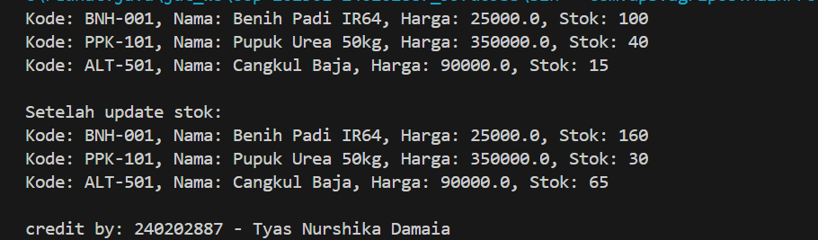

# Laporan Praktikum Minggu 2
Topik: Class dan Object (Produk Pertanian)

## Identitas
- Nama  : Tyas Nurshika Damaia
- NIM   : 240202887
- Kelas : 3IKRB

---

## Tujuan
- Mahasiswa mampu menjelaskan konsep class, object, atribut, dan method dalam OOP.
- Mahasiswa mampu menerapkan access modifier dan enkapsulasi dalam pembuatan class.
- Mahasiswa mampu mengimplementasikan class Produk pertanian dengan atribut dan method yang sesuai.
- Mahasiswa mampu mendemonstrasikan instansiasi object serta menampilkan data produk pertanian di console.
- Mahasiswa mampu menyusun laporan praktikum dengan bukti kode, hasil eksekusi, dan analisis sederhana.


---

## Dasar Teori
Class adalah blueprint atau cetak biru dari sebuah objek. Objek merupakan instansiasi dari class yang berisi atribut (data) dan method (perilaku). Dalam OOP, enkapsulasi dilakukan dengan menyembunyikan data menggunakan access modifier (public, private, protected) serta menyediakan akses melalui getter dan setter.

Dalam konteks Agri-POS, produk pertanian seperti benih, pupuk, dan alat pertanian dapat direpresentasikan sebagai objek yang memiliki atribut nama, harga, dan stok. Dengan menggunakan class, setiap produk dapat dibuat, dikelola, dan dimanipulasi secara lebih terstruktur.


---

## Langkah Praktikum

1. Membuat Class Produk

- Buat file `Produk.java` pada package `model`.
- Tambahkan atribut: `kode`, `nama`, `harga`, dan `stok`.
- Gunakan enkapsulasi dengan menjadikan atribut bersifat private dan membuat getter serta setter untuk masing-masing atribut.

2. Membuat Class CreditBy

- Buat file `CreditBy.java` pada package `util`.
- Isi class dengan method statis untuk menampilkan identitas mahasiswa di akhir output: `credit by: <NIM> - <Nama>`.

3.Membuat Objek Produk dan Menampilkan Credit

Buat file MainProduk.java.
Instansiasi minimal tiga objek produk, misalnya "Benih Padi", "Pupuk Urea", dan satu produk alat pertanian.
Tampilkan informasi produk melalui method getter.
Panggil CreditBy.print("<NIM>", "<Nama>") di akhir main untuk menampilkan identitas.

4.Commit dan Push

Commit dengan pesan: `week2-class-object.`


---

## Kode Program

1.Produk.java 

```java
package com.upb.agripos.model;

public class Produk {
    private String kode;
    private String nama;
    private double harga;
    private int stok;

    public Produk(String kode, String nama, double harga, int stok) {
        this.kode = kode;
        this.nama = nama;
        this.harga = harga;
        this.stok = stok;
    }

    public String getKode() { return kode; }
    public void setKode(String kode) { this.kode = kode; }

    public String getNama() { return nama; }
    public void setNama(String nama) { this.nama = nama; }

    public double getHarga() { return harga; }
    public void setHarga(double harga) { this.harga = harga; }

    public int getStok() { return stok; }
    public void setStok(int stok) { this.stok = stok; }

    public void tambahStok(int jumlah) {
        this.stok += jumlah;
    }

    public void kurangiStok(int jumlah) {
        if (this.stok >= jumlah) {
            this.stok -= jumlah;
        } else {
            System.out.println("Stok tidak mencukupi!");
        }
    }
}
```
2. CreditBy.java

```java
package com.upb.agripos.util;

public class CreditBy {
    public static void print(String nim, String nama) {
        System.out.println("\ncredit by: " + nim + " - " + nama);
    }
}
```
3. MainProduk.java

```java
package com.upb.agripos;

import com.upb.agripos.model.Produk;
import com.upb.agripos.util.CreditBy;

public class MainProduk {
    public static void main(String[] args) {
        Produk p1 = new Produk("BNH-001", "Benih Padi IR64", 25000, 100);
        Produk p2 = new Produk("PPK-101", "Pupuk Urea 50kg", 350000, 40);
        Produk p3 = new Produk("ALT-501", "Cangkul Baja", 90000, 15);

        System.out.println("Kode: " + p1.getKode() + ", Nama: " + p1.getNama() + ", Harga: " + p1.getHarga() + ", Stok: " + p1.getStok());
        System.out.println("Kode: " + p2.getKode() + ", Nama: " + p2.getNama() + ", Harga: " + p2.getHarga() + ", Stok: " + p2.getStok());
        System.out.println("Kode: " + p3.getKode() + ", Nama: " + p3.getNama() + ", Harga: " + p3.getHarga() + ", Stok: " + p3.getStok());
        
        //Tambah dan kurangi stok
        p1.tambahStok(60);
        p2.kurangiStok(10);
        p3.tambahStok(50);

        System.out.println("\nSetelah update stok:");
        System.out.println("Kode: " + p1.getKode() + ", Nama: " + p1.getNama() + ", Harga: " + p1.getHarga() + ", Stok: " + p1.getStok());
        System.out.println("Kode: " + p2.getKode() + ", Nama: " + p2.getNama() + ", Harga: " + p2.getHarga() + ", Stok: " + p2.getStok());
        System.out.println("Kode: " + p3.getKode() + ", Nama: " + p3.getNama() + ", Harga: " + p3.getHarga() + ", Stok: " + p3.getStok());

        // Tampilkan identitas mahasiswa
        CreditBy.print("240202887", "Tyas Nurshika Damaia");
    }
}
```
---

## Hasil Eksekusi
 


---

## Analisis

- Jelaskan bagaimana kode berjalan.  

Program ini menampilkan penerapan konsep dasar OOP di Java dengan tiga kelas yang saling terhubung melalui package. Kelas Produk digunakan untuk merepresentasikan data produk seperti kode, nama, harga, dan stok serta menyediakan method untuk menambah dan mengurangi stok. Kelas MainProduk berfungsi sebagai program utama yang membuat beberapa objek produk, menampilkan data awal, memperbarui stok, lalu mencetak hasil perubahan tersebut ke layar. Terakhir, kelas CreditBy digunakan untuk menampilkan identitas pembuat program. Saat dijalankan, program menampilkan informasi produk sebelum dan sesudah stok diperbarui, kemudian mencetak keterangan pembuatnya di akhir output.

- Apa perbedaan pendekatan minggu ini dibanding minggu sebelumnya. 

Perbedaan utama program ini dengan praktikum minggu kemarin terletak pada cara pengorganisasian kode dan penerapan konsep OOP. Jika pada minggu sebelumnya pendekatan prosedural hanya menggunakan fungsi-fungsi tanpa pembagian kelas, dan pendekatan fungsional menekankan pemrosesan data melalui fungsi murni tanpa menyimpan status, maka pada program ini digunakan pendekatan berorientasi objek (OOP) yang membungkus data dan perilaku dalam satu kesatuan bernama class. Setiap objek Produk memiliki atribut dan method sendiri, sehingga lebih terstruktur, mudah dikembangkan, dan mendukung konsep seperti enkapsulasi dan modularitas. Dengan kata lain, OOP memungkinkan program lebih fleksibel dan efisien dalam mengelola banyak data dibandingkan pendekatan prosedural atau fungsional yang cenderung linear dan terpisah.

- Kendala yang dihadapi dan cara mengatasinya.  
kode tidak berjalan cara mengatasi dengan debug java dulu

---

## Kesimpulan
Pada praktikum ini, belajar bagaimana cara membuat program dengan konsep OOP (Object-Oriented Programming) atau pemrograman berorientasi objek. Lewat program Agri-POS ini,  membuat class Produk, CreditBy, dan MainProduk agar kode lebih rapi dan mudah diatur. Setiap produk, seperti benih, pupuk, atau alat pertanian, dibuat jadi objek yang punya data sendiri (nama, harga, stok) dan bisa melakukan tindakan seperti menambah atau mengurangi stok.

Dari praktikum ini bisa disimpulkan bahwa dengan OOP, program jadi lebih teratur, gampang dikembangkan, dan tidak berantakan. Setiap bagian punya tugasnya sendiri, jadi kalau mau ubah atau tambah fitur di masa depan, semuanya lebih mudah.

---

## Quiz
1. Mengapa atribut sebaiknya dideklarasikan sebagai private dalam class?  
   **Jawaban:** atribut dibuat private supaya data tidak sembarangan diakses atau diubah dari luar, dan hanya bisa dimanipulasi dengan cara yang aman melalui method yang sudah disediakan yaitu getter dan setter.

2. Apa fungsi getter dan setter dalam enkapsulasi?  
   **Jawaban:** 
   - Getter digunakan untuk mengambil atau membaca nilai dari atribut yang bersifat private.

   - Setter digunakan untuk mengubah atau menetapkan nilai atribut tersebut, tapi dengan aturan tertentu agar data tetap valid.
   Fungsi getter dan setter dalam enkapsulasi adalah untuk mengatur cara akses dan perubahan data di dalam suatu objek agar tetap aman dan terkontrol. 

3. Bagaimana cara class Produk mendukung pengembangan aplikasi POS yang lebih kompleks?
   **Jawaban:** Class Produk mendukung pengembangan aplikasi POS yang lebih kompleks karena menjadi dasar untuk mengelola data produk dengan cara yang terstruktur dan aman. Dengan adanya atribut seperti kode, nama, harga, dan stok, aplikasi bisa menambah fitur lain seperti transaksi, laporan, atau manajemen inventori tanpa harus mengubah banyak kode. Selain itu, karena menggunakan enkapsulasi, data produk tetap terlindungi dan hanya bisa diubah melalui method yang sudah disediakan, sehingga sistem lebih stabil dan mudah dikembangkan.
