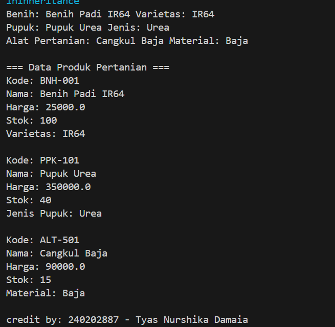

# Laporan Praktikum Minggu 3 
Topik: Inheritance (Kategori Produk)

## Identitas
- Nama  : Tyas Nurshika Damaia
- NIM   : 240202887
- Kelas : 3IKRB

---

## Tujuan
- Mahasiswa mampu menjelaskan konsep inheritance (pewarisan class) dalam OOP.
- Mahasiswa mampu membuat superclass dan subclass untuk produk pertanian.
- Mahasiswa mampu mendemonstrasikan hierarki class melalui contoh kode.
- Mahasiswa mampu menggunakan super untuk memanggil konstruktor dan method parent class.
- Mahasiswa mampu membuat laporan praktikum yang menjelaskan perbedaan penggunaan inheritance dibanding class tunggal.

---

## Dasar Teori
Inheritance adalah mekanisme dalam OOP yang memungkinkan suatu class mewarisi atribut dan method dari class lain.  
- **Superclass**: class induk yang mendefinisikan atribut umum.  
- **Subclass**: class turunan yang mewarisi atribut/method superclass, dan dapat menambahkan atribut/method baru.  
- `super` digunakan untuk memanggil konstruktor atau method superclass.  

Dalam konteks Agri-POS, kita dapat membuat class `Produk` sebagai superclass, kemudian `Benih`, `Pupuk`, dan `AlatPertanian` sebagai subclass. Hal ini membuat kode lebih reusable dan terstruktur.

---

## Langkah Praktikum
1. **Membuat Superclass Produk**  
   - Gunakan class `Produk` dari Bab 2 sebagai superclass.  

2. **Membuat Subclass**  
   - `Benih.java` → atribut tambahan: varietas.  
   - `Pupuk.java` → atribut tambahan: jenis pupuk (Urea, NPK, dll).  
   - `AlatPertanian.java` → atribut tambahan: material (baja, kayu, plastik).  

3. **Membuat Main Class**  
   - Instansiasi minimal satu objek dari tiap subclass.  
   - Tampilkan data produk dengan memanfaatkan inheritance.  

4. **Menambahkan CreditBy**  
   - Panggil class `CreditBy` untuk menampilkan identitas mahasiswa.  

5. **Commit dan Push**  
   - Commit dengan pesan: `week3-inheritance`. 

---

## Kode Program

### Benih.java
```java
package com.upb.agripos.model;

public class Benih extends Produk {
    private String varietas;

    public Benih(String kode, String nama, double harga, int stok, String varietas) {
        super(kode, nama, harga, stok);
        this.varietas = varietas;
    }

    public String getVarietas() { return varietas; }
    public void setVarietas(String varietas) { this.varietas = varietas; }

     @Override
    public void tampilkanInfo() {
        super.tampilkanInfo(); // tampilkan info dari Produk
        System.out.println("Varietas: " + varietas);
    }
}
```

### Pupuk.java
```java
package com.upb.agripos.model;

public class Pupuk extends Produk {
    private String jenis;

    public Pupuk(String kode, String nama, double harga, int stok, String jenis) {
        super(kode, nama, harga, stok);
        this.jenis = jenis;
    }

    public String getJenis() { return jenis; }
    public void setJenis(String jenis) { this.jenis = jenis; }

    @Override
    public void tampilkanInfo() {
        super.tampilkanInfo();
        System.out.println("Jenis Pupuk: " + jenis);
    }
}
```

### AlatPertanian.java
```java
package com.upb.agripos.model;

public class AlatPertanian extends Produk {
    private String material;

    public AlatPertanian(String kode, String nama, double harga, int stok, String material) {
        super(kode, nama, harga, stok);
        this.material = material;
    }

    public String getMaterial() { return material; }
    public void setMaterial(String material) { this.material = material; }

    @Override
    public void tampilkanInfo() {
        super.tampilkanInfo();
        System.out.println("Material: " + material);
    }
}
```

### Produk.java
```java
package com.upb.agripos.model;

public class Produk {
    private String kode;
    private String nama;
    private double harga;
    private int stok;

    public Produk(String kode, String nama, double harga, int stok) {
        this.kode = kode;
        this.nama = nama;
        this.harga = harga;
        this.stok = stok;
    }

    public String getKode() { return kode; }
    public void setKode(String kode) { this.kode = kode; }

    public String getNama() { return nama; }
    public void setNama(String nama) { this.nama = nama; }

    public double getHarga() { return harga; }
    public void setHarga(double harga) { this.harga = harga; }

    public int getStok() { return stok; }
    public void setStok(int stok) { this.stok = stok; }

    public void tambahStok(int jumlah) {
        this.stok += jumlah;
    }

    public void kurangiStok(int jumlah) {
        if (this.stok >= jumlah) {
            this.stok -= jumlah;
        } else {
            System.out.println("Stok tidak mencukupi!");
        }
    }
    public void tampilkanInfo() {
        System.out.println("Kode: " + kode);
        System.out.println("Nama: " + nama);
        System.out.println("Harga: " + harga);
        System.out.println("Stok: " + stok);
    }
}
```

### CreditBy.java
```java
package com.upb.agripos.util;

public class CreditBy {
   public CreditBy() {
   }

   public static void print(String var0, String var1) {
      System.out.println("\ncredit by: " + var0 + " - " + var1);
   }
}
```

### MainInheritance.java
```java
package com.upb.agripos;

import com.upb.agripos.model.*;
import com.upb.agripos.util.CreditBy;

public class MainInheritance {
    public static void main(String[] args) {
        Benih b = new Benih("BNH-001", "Benih Padi IR64", 25000, 100, "IR64");
        Pupuk p = new Pupuk("PPK-101", "Pupuk Urea", 350000, 40, "Urea");
        AlatPertanian a = new AlatPertanian("ALT-501", "Cangkul Baja", 90000, 15, "Baja");

        System.out.println("Benih: " + b.getNama() + " Varietas: " + b.getVarietas());
        System.out.println("Pupuk: " + p.getNama() + " Jenis: " + p.getJenis());
        System.out.println("Alat Pertanian: " + a.getNama() + " Material: " + a.getMaterial());

        System.out.println("\n=== Data Produk Pertanian ===");
        b.tampilkanInfo();
        System.out.println();
        p.tampilkanInfo();
        System.out.println();
        a.tampilkanInfo();

        CreditBy.print("240202887", "Tyas Nurshika Damaia");
    }
}
```

---

## Hasil Eksekusi



---

## Analisis

Program ini berjalan dimulai dari class MainInheritance yang berfungsi sebagai kelas utama. Di dalamnya dibuat tiga objek dari subclass, yaitu Benih, Pupuk, dan AlatPertanian. Masing-masing objek dibuat menggunakan konstruktor yang memanggil konstruktor milik superclass Produk dengan keyword super(). Konstruktor tersebut digunakan untuk menginisialisasi atribut yang dimiliki semua produk seperti kode, nama, harga, dan stok. Setelah itu, subclass menambahkan atribut khusus, misalnya varietas pada benih, jenis pada pupuk, dan material pada alat pertanian.
Ketika method tampilkanInfo() dipanggil, program pertama-tama menampilkan data dari superclass melalui super.tampilkanInfo(), kemudian menambahkan informasi tambahan yang spesifik sesuai jenis produk. Di akhir program, method CreditBy.print() dijalankan untuk menampilkan identitas pembuat kode, yaitu nama dan NIM mahasiswa.

Pendekatan pada praktikum minggu ini berbeda dengan minggu sebelumnya. Jika sebelumnya semua data dan perilaku produk ditempatkan dalam satu class tunggal, sekarang konsep inheritance digunakan untuk memisahkan tanggung jawab antar class. Superclass Produk menampung atribut dan method yang bersifat umum, sedangkan subclass hanya menambahkan bagian yang spesifik sesuai jenis produknya. Pendekatan ini membuat kode lebih terorganisir, mudah dikembangkan, dan tidak perlu menulis ulang kode yang sama berulang kali.

Selama praktikum, sempat muncul kendala berupa error “package tidak ditemukan” saat mengimpor class dari folder lain. Masalah ini terjadi karena struktur folder dan deklarasi package belum sesuai. Setelah dicek kembali dan disesuaikan antara nama package di dalam file dengan struktur direktori proyek, program bisa dijalankan dengan benar. Selain itu, sempat terjadi kesalahan pada pemanggilan konstruktor super() karena urutan parameternya tidak sama dengan konstruktor di superclass. Masalah ini diatasi dengan menyesuaikan urutan dan tipe data parameternya. Setelah semua diperbaiki, program berhasil dijalankan dan menampilkan hasil yang sesuai dengan tujuan praktikum.  

---

## Kesimpulan

Dari praktikum ini, saya memahami bahwa konsep inheritance dalam pemrograman berorientasi objek memungkinkan suatu class mewarisi atribut dan method dari class lain. Dengan membuat Produk sebagai superclass dan Benih, Pupuk, serta AlatPertanian sebagai subclass, program menjadi lebih terstruktur, efisien, dan mudah dikembangkan. Inheritance membantu mengurangi duplikasi kode karena atribut dan method yang bersifat umum hanya perlu ditulis satu kali di superclass, sementara subclass cukup menambahkan fitur khusus sesuai kebutuhannya. Melalui implementasi ini, prinsip reusability dan maintainability dalam OOP dapat diterapkan dengan baik.

---

## Quiz
1. Apa keuntungan menggunakan inheritance dibanding membuat class terpisah tanpa hubungan?
   **Jawaban:** Keuntungan menggunakan inheritance dibanding membuat class terpisah tanpa hubungan adalah kode menjadi lebih efisien, terstruktur, dan mudah dipelihara. Dengan inheritance, atribut dan method yang bersifat umum cukup ditulis sekali di superclass, kemudian dapat digunakan kembali oleh semua subclass tanpa perlu duplikasi kode. Hal ini membuat program lebih mudah dikembangkan, karena jika ada perubahan pada bagian umum, cukup dilakukan di satu tempat saja. Selain itu, hubungan antar class menjadi lebih jelas dan logis, sesuai konsep hierarki dalam OOP.

2. Bagaimana cara subclass memanggil konstruktor superclass?  
   **Jawaban:** Subclass dapat memanggil konstruktor superclass dengan menggunakan keyword super() di dalam konstruktor subclass. Pemanggilan ini harus diletakkan pada baris pertama di dalam konstruktor. Tujuannya adalah untuk menginisialisasi atribut-atribut yang dimiliki oleh superclass sebelum menambahkan atribut khusus milik subclass.

3. Berikan contoh kasus di POS pertanian selain Benih, Pupuk, dan Alat Pertanian yang bisa dijadikan subclass.  
   **Jawaban:** - ObatTanaman

Class ini dapat digunakan untuk merepresentasikan produk pestisida atau fungisida yang berfungsi melindungi tanaman dari hama dan penyakit. Subclass ObatTanaman bisa mewarisi atribut umum dari Produk seperti kode, nama, harga, dan stok, lalu menambahkan atribut khusus seperti jenisHama, dosisPemakaian, dan bentuk (cair, serbuk, atau granul).

Contohnya:

```java
public class ObatTanaman extends Produk {
    private String jenisHama;
    private String dosisPemakaian;

    public ObatTanaman(String kode, String nama, double harga, int stok, String jenisHama, String dosisPemakaian) {
        super(kode, nama, harga, stok);
        this.jenisHama = jenisHama;
        this.dosisPemakaian = dosisPemakaian;
    }

    @Override
    public void tampilkanInfo() {
        super.tampilkanInfo();
        System.out.println("Jenis Hama: " + jenisHama);
        System.out.println("Dosis Pemakaian: " + dosisPemakaian);
    }
} 
```

Dengan subclass ini, sistem POS pertanian dapat mengelola data obat tanaman secara lebih spesifik tanpa harus menulis ulang atribut umum dari produk lain.
