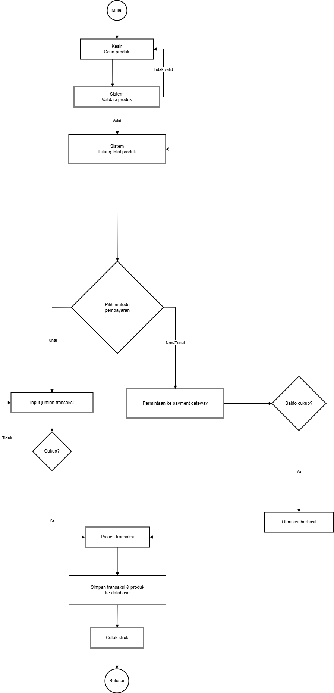
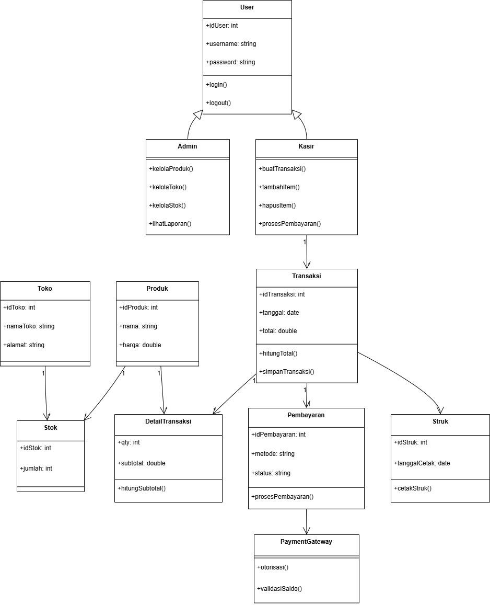

# Laporan Praktikum Minggu 6 
Topik: Desain Arsitektur Sistem dengan UML dan Prinsip SOLID

## Identitas
- Nama  : Tyas Nurshika Damaia
- NIM   : 240202887
- Kelas : 3IKRB

---

## Tujuan
Mahasiswa mampu:

1. Mahasiswa mampu mengidentifikasi kebutuhan sistem ke dalam diagram UML.
2. Mahasiswa mampu menggambar UML Class Diagram dengan relasi antar class yang tepat.
3. Mahasiswa mampu menjelaskan prinsip desain OOP (SOLID).
4. Mahasiswa mampu menerapkan minimal dua prinsip SOLID dalam kode program.

---

## Dasar Teori
Buatlah **desain arsitektur sistem *Agri-POS*** menggunakan **UML** (minimal empat diagram) dan penerapan **prinsip SOLID**, untuk memenuhi **kebutuhan sistem** yang dijelaskan di bawah ini.
Anda **diperbolehkan menggunakan tools apa pun** (Graphviz, StarUML, draw.io, PlantUML, Lucidchart, dan lain-lain), asalkan hasil akhir disimpan dan dikumpulkan dalam format **`.png` atau `.pdf`**, bisa dikumpulkan beserta file sumbernya (`.dot`, `.uml`, `.drawio`, dan sebagainya).

### A. Functional Requirements

1. **Manajemen Produk**
   Sistem dapat menambah, mengubah, menghapus, dan menampilkan data produk pertanian (benih, pupuk, alat, obat).
   Produk memiliki atribut: `kode`, `nama`, `kategori`, `harga`, dan `stok`.

2. **Transaksi Penjualan**
   Kasir dapat membuat transaksi baru, menambahkan produk ke keranjang, menghitung total, dan menyelesaikan pembayaran.

3. **Metode Pembayaran**
   Sistem mendukung pembayaran tunai dan e-wallet. Di masa depan, metode lain seperti transfer bank harus dapat ditambahkan tanpa mengubah kode lama.

4. **Pencetakan Struk dan Laporan**
   Setelah pembayaran berhasil, sistem menampilkan atau mencetak struk.
   Admin dapat melihat laporan penjualan harian atau periodik.

5. **Login dan Hak Akses**
   Kasir dan admin memiliki hak akses berbeda (kasir untuk transaksi, admin untuk produk dan laporan).

---

## Langkah Praktikum
Iterasi disarankan agar progres terpantau dan kualitas meningkat:

1. Pemetaan kebutuhan → daftar aktor & use case; gambar Use Case Diagram versi-1.
2. Activity Diagram proses “Checkout” (lengkap dengan swimlane Kasir/Sistem/Payment Gateway) + skenario normal dan gagal.
3. Sequence Diagram proses pembayaran (variasi: tunai vs e-wallet, alt saldo tidak cukup).
4. Class Diagram (atribut/tipe, method, visibility, multiplicity) + mapping prinsip SOLID; revisi konsistensi lintas diagram.

Setiap iterasi lakukan commit incremental dengan pesan: `week6-uml-solid: iterasi-N <deskripsi>`.

---

## Kode Program
**Activity.drawio**
flowchart TD
    A([Mulai]) --> B[Kasir Scan Produk]
    B --> C[Sistem Validasi Produk]

    C -->|Tidak valid| B
    C -->|Valid| D[Sistem Hitung Total Produk]

    D --> E{Pilih Metode Pembayaran}

    %% =====================
    %% PEMBAYARAN TUNAI
    %% =====================
    E -->|Tunai| F[Input Jumlah Transaksi]
    F --> G{Cukup?}
    G -->|Tidak| F
    G -->|Ya| H[Proses Transaksi]

    %% =====================
    %% PEMBAYARAN NON-TUNAI
    %% =====================
    E -->|Non-Tunai| I[Permintaan ke Payment Gateway]
    I --> J{Saldo Cukup?}
    J -->|Tidak| I
    J -->|Ya| K[Otorisasi Berhasil]
    K --> H

    %% =====================
    %% PENYELESAIAN
    %% =====================
    H --> L[Simpan Transaksi & Produk ke Database]
    L --> M[Cetak Struk]
    M --> N([Selesai])

**Class.drawio**
classDiagram
    %% =====================
    %% User & Role
    %% =====================
    class User {
        +idUser: int
        +username: string
        +password: string
        +login()
        +logout()
    }

    class Admin {
        +kelolaProduk()
        +kelolaToko()
        +kelolaStok()
        +lihatLaporan()
    }

    class Kasir {
        +buatTransaksi()
        +tambahItem()
        +hapusItem()
        +prosesPembayaran()
    }

    User <|-- Admin
    User <|-- Kasir

    %% =====================
    %% Produk & Stok
    %% =====================
    class Produk {
        +idProduk: int
        +nama: string
        +harga: double
    }

    class Toko {
        +idToko: int
        +namaToko: string
        +alamat: string
    }

    class Stok {
        +idStok: int
        +jumlah: int
    }

    Produk "1" --> "*" Stok
    Toko "1" --> "*" Stok

    %% =====================
    %% Transaksi
    %% =====================
    class Transaksi {
        +idTransaksi: int
        +tanggal: date
        +total: double
        +hitungTotal()
        +simpanTransaksi()
    }

    class DetailTransaksi {
        +qty: int
        +subtotal: double
        +hitungSubtotal()
    }

    Transaksi "1" --> "*" DetailTransaksi
    Produk "1" --> "*" DetailTransaksi
    Kasir "1" --> "*" Transaksi

    %% =====================
    %% Pembayaran
    %% =====================
    class Pembayaran {
        +idPembayaran: int
        +metode: string
        +status: string
        +prosesPembayaran()
    }

    class PaymentGateway {
        +otorisasi()
        +validasiSaldo()
    }

    Transaksi "1" --> "1" Pembayaran
    Pembayaran --> PaymentGateway

    %% =====================
    %% Output
    %% =====================
    class Struk {
        +idStruk: int
        +tanggalCetak: date
        +cetakStruk()
    }

    Transaksi --> Struk

**Sequence.drawio**
sequenceDiagram
    actor Kasir
    participant UI as POS UI
    participant Cart as Cart Service
    participant Inv as Inventory Service
    participant Pay as Payment Service
    participant PG as Payment Gateway
    participant DB as Database

    Kasir ->> UI: 1) Klik tombol "Checkout"
    UI ->> Cart: 2) Hitung total belanja
    Cart ->> Inv: 3) Periksa stok seluruh produk
    Inv -->> Cart: 4) Status stok

    alt Stok tidak mencukupi
        Cart -->> UI: Tampilkan notifikasi stok tidak cukup
        UI -->> Kasir: Checkout dibatalkan
    else Stok mencukupi
        Cart -->> UI: 5) Kirim total belanja
        Kasir ->> UI: 6) Pilih metode pembayaran\n(Tunai / E-Wallet)

        alt Pembayaran Tunai
            Kasir ->> UI: 7) Input jumlah uang pelanggan
            UI ->> Pay: 8) Proses pembayaran tunai
            alt Uang tidak cukup
                Pay -->> UI: Tampilkan pesan uang tidak cukup
                UI -->> Kasir: Minta input ulang
            else Uang cukup
                Pay ->> DB: 9) Simpan transaksi
                Pay ->> Inv: 10) Update stok produk
                Inv ->> DB: Update data stok
                DB -->> Inv: OK
                Inv -->> Pay: 11) Stok berhasil diperbarui
                Pay -->> UI: 12) Transaksi berhasil
                UI -->> Kasir: 13) Cetak struk
            end
        else Pembayaran E-Wallet
            UI ->> Pay: 7) Buat permintaan pembayaran e-wallet
            Pay ->> PG: 8) Kirim permintaan transaksi
            PG -->> Pay: 9) Status pembayaran (sukses/gagal)

            alt Pembayaran gagal
                Pay -->> UI: Tampilkan status gagal
                UI -->> Kasir: Pilih metode pembayaran ulang
            else Pembayaran sukses
                Pay ->> DB: 10) Simpan transaksi
                Pay ->> Inv: 11) Update stok produk
                Inv ->> DB: Update data stok
                DB -->> Inv: OK
                Inv -->> Pay: 12) Stok berhasil diperbarui
                Pay -->> UI: 13) Transaksi berhasil
                UI -->> Kasir: 14) Cetak struk
            end
        end
    end

**Usecase.drawio**
usecaseDiagram
actor Admin
actor Kasir
actor "Payment Gateway" as PG

%% =====================
%% USE CASE ADMIN
%% =====================
Admin --> (Login)
Admin --> (Kelola Produk)
Admin --> (Kelola Toko)
Admin --> (Kelola Stok per Toko)
Admin --> (Lihat Laporan Penjualan)

%% =====================
%% USE CASE KASIR
%% =====================
Kasir --> (Login)
Kasir --> (Buat Transaksi)
Kasir --> (Tambah Item)
Kasir --> (Hapus Item)
Kasir --> (Proses Pembayaran)
Kasir --> (Cetak Struk)

%% =====================
%% RELASI INCLUDE
%% =====================
(Buat Transaksi) ..> (Tambah Item) : <<include>>
(Buat Transaksi) ..> (Proses Pembayaran) : <<include>>
(Tambah Item) ..> (Hitung Total Belanja) : <<include>>
(Proses Pembayaran) ..> (Hitung Total Belanja) : <<include>>

%% =====================
%% RELASI EXTEND
%% =====================
(Hapus Item) ..> (Buat Transaksi) : <<extend>>

%% =====================
%% PAYMENT GATEWAY
%% =====================
(Proses Pembayaran) --> PG

---

## Hasil Eksekusi
  

---

## Analisis

1. Penjelasan bagaimana kode berjalan

Kode Mermaid yang digunakan merepresentasikan alur kerja sistem Agri-POS melalui beberapa diagram UML. Pada Use Case Diagram, sistem dimodelkan dari sudut pandang aktor, yaitu Admin dan Kasir, sehingga terlihat dengan jelas hak akses dan fungsi masing-masing pengguna. Admin berfokus pada pengelolaan data dan laporan, sedangkan Kasir berfokus pada proses transaksi.

Pada Activity Diagram, alur proses checkout digambarkan secara detail mulai dari kasir melakukan scan produk, sistem memvalidasi produk, menghitung total belanja, hingga proses pembayaran. Diagram ini juga menunjukkan percabangan kondisi, seperti produk tidak valid, uang atau saldo tidak mencukupi, serta pemisahan alur pembayaran tunai dan e-wallet sampai transaksi selesai dan struk dicetak.

Selanjutnya, Sequence Diagram menggambarkan urutan interaksi antar komponen sistem secara kronologis. Diagram ini memperlihatkan bagaimana kasir berinteraksi dengan antarmuka POS, layanan keranjang, inventori, pembayaran, payment gateway, dan database. Adanya blok alt menunjukkan skenario alternatif seperti stok tidak cukup atau pembayaran gagal, sehingga sistem dapat menangani berbagai kondisi secara realistis.

Pada Class Diagram, struktur kelas dan relasi antar kelas ditampilkan secara statis. Diagram ini menunjukkan pembagian tanggung jawab antar kelas, relasi pewarisan antara User, Admin, dan Kasir, serta relasi antar entitas utama seperti Produk, Transaksi, DetailTransaksi, dan Pembayaran. Dengan demikian, keseluruhan kode diagram saling terhubung dan merepresentasikan sistem secara utuh dari sisi fungsi, alur, interaksi, dan struktur data.

2. Perbedaan pendekatan minggu ini dibanding minggu sebelumnya

Pendekatan pada praktikum minggu ini lebih menekankan pada desain arsitektur sistem secara menyeluruh dengan menggunakan beberapa diagram UML yang saling konsisten. Fokus utama bukan hanya pada fungsi yang tersedia, tetapi juga pada alur proses, interaksi antar komponen, serta struktur kelas dan relasinya, kemudian dikaitkan dengan prinsip desain OOP dan SOLID.

Berbeda dengan minggu sebelumnya yang lebih berfokus pada abstraction dan interface, di mana pembahasan cenderung menekankan pemisahan tanggung jawab dan kontrak antar komponen tanpa menggambarkan alur proses secara detail. Pada minggu ini, abstraction dan interface tetap digunakan, namun dikombinasikan dengan pemodelan UML yang lengkap sehingga sistem dapat dipahami baik dari sisi konseptual maupun implementasi.

Dengan kata lain, minggu sebelumnya menekankan apa saja komponen sistem, sedangkan minggu ini menekankan bagaimana komponen tersebut bekerja bersama dalam satu arsitektur yang utuh.

3. Kendala yang dihadapi dan cara mengatasinya

Kendala utama yang dihadapi adalah menjaga konsistensi antar diagram UML. Setiap perubahan pada satu diagram, seperti penambahan proses pembayaran atau relasi kelas, harus disesuaikan dengan diagram lainnya agar tidak terjadi perbedaan konsep. Selain itu, menentukan relasi yang tepat pada class diagram, seperti penggunaan aggregation, composition, dan pewarisan, juga memerlukan pemahaman yang matang.

Kendala lainnya adalah memodelkan alur alternatif dan kondisi gagal (stok tidak cukup, saldo tidak cukup, pembayaran gagal) agar tetap jelas namun tidak membuat diagram menjadi terlalu kompleks.

Cara mengatasinya dilakukan dengan membagi proses ke dalam langkah-langkah yang lebih sederhana, menggunakan notasi UML secara konsisten, serta melakukan pengecekan ulang terhadap setiap diagram agar sesuai dengan kebutuhan sistem dan prinsip SOLID. Dengan pendekatan iteratif, desain sistem menjadi lebih rapi, mudah dipahami, dan siap untuk dikembangkan lebih lanjut.
---

## Kesimpulan
Kesimpulannya, perancangan sistem kasir yang dibuat telah menggabungkan konsep pemodelan dan prinsip pemrograman berorientasi objek secara terpadu. Kode Mermaid digunakan untuk menggambarkan alur proses dan interaksi sistem secara jelas, mulai dari validasi produk, perhitungan total, hingga proses pembayaran dan pencetakan struk, sehingga alur kerja sistem mudah dipahami sebelum diimplementasikan ke dalam kode program.

Selain itu, penerapan konsep desain seperti aggregation dan composition membantu membedakan hubungan antar objek berdasarkan tingkat ketergantungannya, sehingga struktur data menjadi lebih rapi dan logis. Prinsip Open/Closed memastikan sistem tetap fleksibel dan mudah dikembangkan tanpa harus mengubah kode yang sudah ada, sedangkan Dependency Inversion Principle (DIP) meningkatkan kemudahan pengujian (testability) dengan mengurangi ketergantungan langsung antar komponen.

Secara keseluruhan, pendekatan ini menghasilkan sistem yang tidak hanya berjalan sesuai kebutuhan, tetapi juga mudah dipahami, mudah dikembangkan, dan mudah diuji, sehingga lebih siap untuk digunakan dan dikembangkan di masa depan.

---

## Quiz
1. Jelaskan perbedaan **aggregation** dan **composition** serta berikan contoh penerapannya pada desain Anda.  
   **Jawaban:** Aggregation adalah hubungan has-a yang lemah, di mana objek anak tetap dapat berdiri sendiri meskipun objek induknya dihapus. Siklus hidup objek tidak saling bergantung. Pada desain sistem kasir, contoh aggregation adalah relasi Toko–Produk, karena produk tetap dapat ada meskipun toko dihapus atau diganti. Notasi UML yang digunakan adalah diamond kosong (◇).

Composition adalah hubungan has-a yang kuat, di mana objek anak tidak dapat berdiri sendiri tanpa objek induknya. Jika objek induk dihapus, maka objek anak ikut terhapus. Pada desain sistem kasir, contoh composition adalah relasi Transaksi–DetailTransaksi, karena detail transaksi tidak memiliki makna tanpa transaksi induknya. Notasi UML yang digunakan adalah diamond terisi (◆).

Perbedaan utama aggregation dan composition terletak pada tingkat ketergantungan dan siklus hidup objek. Aggregation bersifat longgar, sedangkan composition bersifat kuat dan saling bergantung.

2. Bagaimana prinsip **Open/Closed** dapat memastikan sistem mudah dikembangkan?  
   **Jawaban:**  Prinsip Open/Closed berarti sistem dibuat agar bisa dikembangkan tanpa harus mengubah kode yang sudah berjalan. Dengan cara ini, ketika ada fitur baru yang ingin ditambahkan, sistem tidak perlu dibongkar ulang sehingga risiko error pada fungsi lama bisa dihindari.

Dalam sistem kasir, misalnya saat ingin menambah metode pembayaran baru, pengembang cukup menambahkan jenis pembayaran baru tanpa mengubah alur transaksi yang sudah ada. Pendekatan ini membuat sistem lebih fleksibel, mudah dikembangkan, dan lebih aman digunakan dalam jangka panjang.

3. Mengapa **Dependency Inversion Principle (DIP)** meningkatkan **testability**? Berikan contoh penerapannya.  
   **Jawaban:** Dependency Inversion Principle (DIP) meningkatkan testability karena sistem tidak bergantung langsung pada kelas konkret, tetapi pada abstraksi (interface). Dengan begitu, komponen dapat diuji secara terpisah tanpa harus melibatkan dependensi asli yang kompleks atau bergantung pada sistem eksternal.

Contohnya pada sistem kasir, kelas Transaksi tidak langsung bergantung pada kelas PembayaranTunai atau PembayaranNonTunai, tetapi pada interface Pembayaran. Saat pengujian, implementasi pembayaran asli dapat diganti dengan mock atau dummy payment untuk mensimulasikan kondisi berhasil atau gagal. Hal ini membuat proses pengujian menjadi lebih mudah, cepat, dan fokus pada logika yang diuji tanpa dipengaruhi oleh sistem lain.
