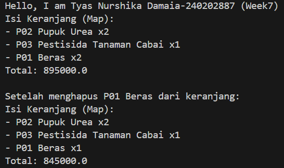

# Laporan Praktikum Minggu 7 
Topik: Collections dan Implementasi Keranjang Belanja

## Identitas
- Nama  : Tyas Nurshika Damaia
- NIM   : 240202887
- Kelas : 3IKRB

---

## Tujuan
Mahasiswa mampu:

1. Menjelaskan konsep collection dalam Java (List, Map, Set).
2. Menggunakan ArrayList untuk menyimpan dan mengelola objek.
3. Mengimplementasikan Map atau Set sesuai kebutuhan pengelolaan data.
4. Melakukan operasi dasar pada collection: tambah, hapus, dan hitung total.
5. Menganalisis efisiensi penggunaan collection dalam konteks sistem Agri-POS.

---

## Dasar Teori

### 1. Collections Framework

Java Collections Framework menyediakan struktur data untuk mengelola objek secara dinamis dan efisien.

Struktur utama:

- List (implementasi: ArrayList) — Terurut, dapat menyimpan elemen duplikat.
- Map (implementasi: HashMap) — Menyimpan pasangan key–value, akses cepat berdasarkan key.
- Set (implementasi: HashSet) — Tidak menerima duplikat dan tidak mempertahankan urutan.

---

### 2. Studi Kasus: Keranjang Belanja Agri-POS

Keranjang belanja harus dapat:

- Menambahkan produk
- Menghapus produk
- Menampilkan isi keranjang
- Menghitung total nilai transaksi
- Menangani jumlah (quantity) menggunakan Map

Kasus ini mencerminkan penggunaan struktur data dalam aplikasi nyata seperti POS.

---

## Langkah Praktikum
Program keranjang belanja ini dibuat dengan package com.upb.agripos. Seluruh file Java diletakkan pada folder yang sesuai dengan nama package agar dapat dikompilasi dan dijalankan tanpa error. Program diawali dengan pembuatan class Product yang berfungsi untuk menyimpan data produk berupa kode, nama, dan harga. Class ini memiliki constructor untuk menginisialisasi data serta method getter untuk mengambil nilai setiap atribut.

Selanjutnya dibuat class ShoppingCart yang menggunakan ArrayList sebagai tempat penyimpanan produk. Class ini menyediakan method untuk menambah dan menghapus produk, menghitung total harga, serta menampilkan isi keranjang. Setiap produk yang ditambahkan akan disimpan satu per satu tanpa memperhitungkan jumlah.

Class MainCart berperan sebagai program utama. Pada class ini dibuat beberapa objek Product, kemudian objek ShoppingCart digunakan untuk menambahkan produk ke dalam keranjang, menampilkan isi keranjang, menghapus salah satu produk, dan menampilkan kembali hasil akhirnya.

Sebagai alternatif, dibuat class ShoppingCartMap yang menggunakan Map untuk menyimpan produk beserta jumlahnya. Dengan pendekatan ini, produk yang sama tidak disimpan berulang kali, melainkan jumlahnya akan bertambah. Class ini juga menyediakan method untuk menambah, mengurangi, menghitung total harga, dan menampilkan isi keranjang beserta quantity.

Program dikompilasi dari folder src menggunakan perintah javac com/upb/agripos/*.java dan dijalankan dengan perintah java com.upb.agripos.MainCart. Hasil eksekusi program menampilkan isi keranjang dan total belanja sesuai dengan proses yang dilakukan.

---


## Kode Program

1. Product.java


```java
package com.upb.agripos;

public class Product {
    private final String code;
    private final String name;
    private final double price;

    public Product(String code, String name, double price) {
        this.code = code;
        this.name = name;
        this.price = price;
    }

    public String getCode() { return code; }
    public String getName() { return name; }
    public double getPrice() { return price; }
}
```

2. shoppingCart.java

```java
package com.upb.agripos;

import java.util.ArrayList;

public class ShoppingCart {
    private final ArrayList<Product> items = new ArrayList<>();

    public void addProduct(Product p) { items.add(p); }
    public void removeProduct(Product p) { items.remove(p); }

    public double getTotal() {
        double sum = 0;
        for (Product p : items) {
            sum += p.getPrice();
        }
        return sum;
    }

    public void printCart() {
        System.out.println("Isi Keranjang:");
        for (Product p : items) {
            System.out.println("- " + p.getCode() + " " + p.getName() + " = " + p.getPrice());
        }
        System.out.println("Total: " + getTotal());
    }
}
```

3. maincart.java

```java
package com.upb.agripos;

public class MainCartMap {
    public static void main(String[] args) {
        System.out.println("Hello, I am Tyas Nurshika Damaia-240202887 (Week7)");

        Product p1 = new Product("P01", "Beras", 50000);
        Product p2 = new Product("P02", "Pupuk Urea", 350000);
        Product p3 = new Product("P03", "Pestisida Tanaman Cabai", 95000);

        ShoppingCartMap cart = new ShoppingCartMap();
        cart.addProduct(p1);
        cart.addProduct(p1);
        cart.addProduct(p2);
        cart.addProduct(p2);
        cart.addProduct(p3);
        cart.printCart();

        System.out.println("\nSetelah menghapus " + p1.getCode() + " " + p1.getName() + " dari keranjang:");
        cart.removeProduct(p1);
        cart.printCart();
    }
}
```

4. ShoppingCartMap.Java

```java
package com.upb.agripos;

import java.util.HashMap;
import java.util.Map;

public class ShoppingCartMap {
    private final Map<Product, Integer> items = new HashMap<>();

    public void addProduct(Product p) { items.put(p, items.getOrDefault(p, 0) + 1); }

    public void removeProduct(Product p) {
        if (!items.containsKey(p)) return;
        int qty = items.get(p);
        if (qty > 1) items.put(p, qty - 1);
        else items.remove(p);
    }

    public double getTotal() {
        double total = 0;
        for (Map.Entry<Product, Integer> entry : items.entrySet()) {
            total += entry.getKey().getPrice() * entry.getValue();
        }
        return total;
    }

    public void printCart() {
        System.out.println("Isi Keranjang (Map):");
        for (Map.Entry<Product, Integer> e : items.entrySet()) {
            System.out.println("- " + e.getKey().getCode() + " " + e.getKey().getName() + " x" + e.getValue());
        }
        System.out.println("Total: " + getTotal());
    }
}
```

---

## Hasil Eksekusi



---

## Analisis
Kode program berjalan dengan memanfaatkan konsep Object-Oriented Programming dan Java Collection Framework. Program diawali dengan pembuatan objek Product yang menyimpan data produk berupa kode, nama, dan harga. Objek-objek produk tersebut kemudian dimasukkan ke dalam keranjang belanja. Pada implementasi ShoppingCart, produk disimpan menggunakan ArrayList, sehingga setiap kali produk ditambahkan, objek produk akan langsung masuk ke dalam daftar. Total belanja dihitung dengan menjumlahkan harga seluruh produk di dalam keranjang. Pada implementasi alternatif ShoppingCartMap, produk disimpan dalam bentuk pasangan key–value (Product dan jumlah), sehingga jika produk yang sama ditambahkan, jumlahnya akan bertambah tanpa menyimpan data produk secara berulang.

Perbedaan pendekatan pada minggu ini dibandingkan minggu sebelumnya terletak pada penggunaan Collection Framework. Pada minggu sebelumnya, pengelolaan data masih menggunakan struktur yang lebih sederhana dan bersifat statis, sedangkan pada minggu ini digunakan ArrayList dan Map yang bersifat dinamis. Pendekatan ini membuat pengelolaan data lebih fleksibel, efisien, serta mendukung operasi seperti penambahan, penghapusan, dan penghitungan data dengan lebih mudah dan terstruktur.

Kendala yang dihadapi selama pengerjaan adalah munculnya error saat proses kompilasi, terutama karena ketidaksesuaian antara nama package, struktur folder, dan cara menjalankan program. Selain itu, penggunaan Map dengan objek sebagai key memerlukan implementasi equals() dan hashCode() agar data tidak terduplikasi. Kendala tersebut diatasi dengan menyamakan package di seluruh file, menyesuaikan struktur folder sesuai dengan package, serta memastikan metode equals() dan hashCode() diterapkan pada class Product.

---

## Kesimpulan
Berdasarkan hasil implementasi dan pengujian program, dapat disimpulkan bahwa penggunaan Java Collection Framework pada pembuatan keranjang belanja mampu meningkatkan efisiensi dan fleksibilitas dalam pengelolaan data produk. Dengan menerapkan pendekatan berbasis objek serta memanfaatkan ArrayList dan Map, program dapat mengelola data secara dinamis, mendukung penambahan dan penghapusan produk, serta menghitung total belanja dengan lebih terstruktur. Pendekatan ini tidak hanya membuat kode lebih rapi dan mudah dikembangkan, tetapi juga memberikan pemahaman yang lebih baik mengenai penerapan struktur data dalam pemrograman Java untuk menyelesaikan permasalahan nyata.

---

## Quiz
1. Jelaskan perbedaan mendasar antara List, Map, dan Set.  
   **Jawaban:** 
   - List → Koleksi terurut dan boleh ada elemen duplikat. Contoh: [1, 2, 2, 3]
   - Set → Koleksi tidak terurut dan tidak boleh ada duplikat. Contoh: {1, 2, 3}
   - Map → Koleksi pasangan key → value, key unik, tapi value bisa duplikat. Contoh: { "a": 1, "b": 2 }

2. Mengapa ArrayList cocok digunakan untuk keranjang belanja sederhana?  
   **Jawaban:**
   ArrayList cocok untuk keranjang belanja sederhana karena beberapa alasan berikut:
   1. Terurut – Item yang ditambahkan akan tetap dalam urutan penambahan, jadi daftar belanja bisa ditampilkan sesuai urutan user menambahkan barang.
   2. Bisa duplikat – Satu jenis barang bisa dibeli lebih dari satu, misalnya 2 botol susu, dan ArrayList bisa menampung duplikat tanpa masalah.
   3. Akses cepat berdasarkan indeks – Jika ingin menampilkan atau mengubah item tertentu, ArrayList memungkinkan akses cepat dengan nomor posisi/item.
   4. Dinamis – Ukurannya otomatis bertambah sesuai jumlah barang, sehingga tidak perlu menentukan kapasitas awal yang pasti.  

3. Bagaimana struktur Set mencegah duplikasi data?  
   **Jawaban:** 
   Set mencegah duplikasi dengan memeriksa identitas/isi elemen sebelum menambahkannya, bukan sekadar menumpuk semua data.  

4.Kapan sebaiknya menggunakan Map dibandingkan List? Jelaskan dengan contoh.
   **Jawaban:** 
   sebaiknya menggunakan Map dibandingkan List ketika data yang ingin disimpan berbentuk pasangan key → value dan kamu ingin mengakses data secara cepat berdasarkan key.

   Alasan menggunakan Map:
   1. Key unik → Setiap item punya identifier yang jelas.
   2. Akses cepat → Bisa langsung ambil value dari key tanpa harus mencari satu per satu seperti di List.
   3. Relasi data jelas → Memudahkan mengaitkan satu data dengan data lain.

   Contoh:
   Map cocok untuk menyimpan stok barang di toko:

   ```java
   Map<String, Integer> stokBarang = new HashMap<>();
   stokBarang.put("Apel", 10);
   stokBarang.put("Pisang", 20);

   // Ambil stok apel langsung
   int stokApel = stokBarang.get("Apel"); // 10
   ```

   List kurang efisien untuk kasus ini, karena untuk mencari stok apel kamu harus iterasi seluruh List.
   Jadi, Map = cepat & rapi untuk data berpasangan key-value, sedangkan List = lebih cocok untuk urutan item atau daftar sederhana.