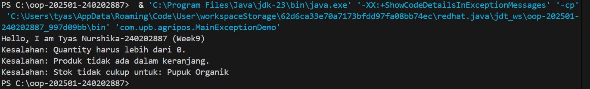

# Laporan Praktikum Minggu 9 
Topik: Exception Handling, Custom Exception, dan Penerapan Design Pattern

## Identitas
- Nama  : Tyas Nurshika Damaia
- NIM   : 240202887
- Kelas : 3IKRB

---

## Tujuan

1. Menjelaskan perbedaan antara error dan exception.
2. Mengimplementasikan try–catch–finally dengan tepat.
3. Membuat custom exception sesuai kebutuhan program.
4. Mengintegrasikan exception handling ke dalam aplikasi sederhana (kasus keranjang belanja).
5. (Opsional) Menerapkan design pattern sederhana (Singleton/MVC) dan unit testing dasar.


---

## Dasar Teori

Exception dan handling adalah mekanisme dalam pemrograman untuk menangani kesalahan (error) atau kondisi tak terduga yang terjadi saat program dijalankan agar tidak langsung berhenti atau crash. Exception merujuk pada kesalahan itu sendiri, seperti pembagian dengan nol, file tidak ditemukan, atau input tidak valid, sedangkan exception handling adalah cara mengelola kesalahan tersebut menggunakan struktur tertentu (misalnya try–catch atau try–except) sehingga program dapat memberikan pesan yang jelas, mengambil tindakan alternatif, atau tetap berjalan dengan aman. Dengan exception handling, program menjadi lebih stabil, mudah dipelihara, dan ramah bagi pengguna karena kesalahan dapat dikontrol dan ditangani dengan baik.

---

## Langkah Praktikum
1️⃣ Buat package

com.upb.agripos


2️⃣ Buat custom exception

- InvalidQuantityException
- ProductNotFoundException
- InsufficientStockException
→ Semua extends Exception

3️⃣ Buat class Product

- Atribut: code, name, price, stock
- Method: reduceStock()

4️⃣ Buat class ShoppingCart

- Simpan item dengan Map<Product, Integer>
- addProduct() → cek qty > 0, jika salah lempar InvalidQuantityException
- removeProduct() → cek produk ada, jika tidak lempar ProductNotFoundException
- checkout() → cek stok, jika kurang lempar InsufficientStockException

5️⃣ Gunakan try–catch di Main

- Jalankan operasi dalam try
- Tangkap error di catch
- Tampilkan pesan dengan e.getMessage()

6️⃣ Tambahkan Singleton (opsional)

- ProductService → satu instance saja

7️⃣ Uji program

- Qty salah → error tertangani
- Produk tidak ada → error tertangani
- Stok kurang → error tertangani

---

## Kode Program

### 1.  Struktur try–catch–finally

```java
try {
    // kode yang berpotensi menimbulkan kesalahan
} catch (Exception e) {
    // penanganan
} finally {
    // blok yang selalu dijalankan
}
```

### 2. Membuat Custom Exception

```java
package com.upb.agripos;

public class InvalidQuantityException extends Exception {
    public InvalidQuantityException(String message) {
        super(message);
    }
}
```
1. Membuat Custom Exception

```java
package com.upb.agripos;

public class InvalidQuantityException extends Exception {
    public InvalidQuantityException(String msg) { super(msg); }
}
```

```java
package com.upb.agripos;

public class ProductNotFoundException extends Exception {
    public ProductNotFoundException(String msg) { super(msg); }
}
```

```java
package com.upb.agripos;

public class InsufficientStockException extends Exception {
    public InsufficientStockException(String msg) { super(msg); }
}
```

### 3. Model Product dengan Stok

```java
package com.upb.agripos;

public class Product {
    private final String code;
    private final String name;
    private final double price;
    private int stock;

    public Product(String code, String name, double price, int stock) {
        this.code = code;
        this.name = name;
        this.price = price;
        this.stock = stock;
    }

    public String getCode() { return code; }
    public String getName() { return name; }
    public double getPrice() { return price; }
    public int getStock() { return stock; }
    public void reduceStock(int qty) { this.stock -= qty; }
}
```

### 4. Implementasi ShoppingCart dengan Exception Handling

```java
package com.upb.agripos;

import java.util.HashMap;
import java.util.Map;

public class ShoppingCart {
    private final Map<Product, Integer> items = new HashMap<>();

    public void addProduct(Product p, int qty) throws InvalidQuantityException {
        if (qty <= 0) {
            throw new InvalidQuantityException("Quantity harus lebih dari 0.");
        }
        items.put(p, items.getOrDefault(p, 0) + qty);
    }

    public void removeProduct(Product p) throws ProductNotFoundException {
        if (!items.containsKey(p)) {
            throw new ProductNotFoundException("Produk tidak ada dalam keranjang.");
        }
        items.remove(p);
    }

    public void checkout() throws InsufficientStockException {
        for (Map.Entry<Product, Integer> entry : items.entrySet()) {
            Product product = entry.getKey();
            int qty = entry.getValue();
            if (product.getStock() < qty) {
                throw new InsufficientStockException(
                    "Stok tidak cukup untuk: " + product.getName()
                );
            }
        }
        // contoh pengurangan stok bila semua cukup
        for (Map.Entry<Product, Integer> entry : items.entrySet()) {
            entry.getKey().reduceStock(entry.getValue());
        }
    }
}
```

### 5. Main Program untuk Menguji Exception Handling

```java
package com.upb.agripos;

public class MainExceptionDemo {
    public static void main(String[] args) {
        System.out.println("Hello, I am [Nama]-[NIM] (Week9)");

        ShoppingCart cart = new ShoppingCart();
        Product p1 = new Product("P01", "Pupuk Organik", 25000, 3);

        try {
            cart.addProduct(p1, -1);
        } catch (InvalidQuantityException e) {
            System.out.println("Kesalahan: " + e.getMessage());
        }

        try {
            cart.removeProduct(p1);
        } catch (ProductNotFoundException e) {
            System.out.println("Kesalahan: " + e.getMessage());
        }

        try {
            cart.addProduct(p1, 5);
            cart.checkout();
        } catch (Exception e) {
            System.out.println("Kesalahan: " + e.getMessage());
        }
    }
}
```

### 6. Singleton Pattern


```java
package com.upb.agripos;

public class ProductService {
    private static ProductService instance;
    private ProductService() {}

    public static ProductService getInstance() {
        if (instance == null) { instance = new ProductService(); }
        return instance;
    }
}
```

---

## Hasil Eksekusi
  


---

## Analisis
Program dimulai dari MainExceptionDemo sebagai controller. Objek Product dan ShoppingCart dibuat, lalu setiap operasi seperti menambah produk, menghapus produk, dan checkout dijalankan di dalam blok try. Jika terjadi kondisi tidak valid (jumlah ≤ 0, produk tidak ada di keranjang, atau stok tidak mencukupi), program akan melempar custom exception dari class ShoppingCart. Exception tersebut kemudian ditangkap oleh catch di main, sehingga program tidak berhenti dan menampilkan pesan kesalahan yang sesuai.

penggunaan custom exception untuk merepresentasikan kesalahan logika bisnis secara jelas dan terstruktur, bukan sekadar error teknis. Setiap jenis masalah—jumlah pembelian tidak valid, produk tidak ditemukan, dan stok tidak mencukupi—memiliki exception sendiri, sehingga alur program menjadi lebih rapi, mudah dibaca, dan mudah dikembangkan. Selain itu, pemisahan antara logika bisnis (ShoppingCart) dan penanganan kesalahan (Main dengan try–catch) menunjukkan penerapan konsep clean code, MVC sederhana, dan praktik pemrograman profesional, di mana program tetap stabil tanpa crash meskipun terjadi kesalahan.

selama program belum ada kendala yang saya alami
---

## Kesimpulan
Penerapan exception handling dan custom exception membuat program lebih aman, terstruktur, dan mudah dipahami karena setiap kesalahan dapat ditangani dengan jelas tanpa menghentikan jalannya aplikasi.

---

## Quiz
1. Jelaskan perbedaan error dan exception.  
   **Jawaban:**Error adalah kesalahan fatal yang terjadi pada sistem dan umumnya tidak dapat    ditangani oleh program, sedangkan exception adalah kondisi kesalahan yang masih dapat diprediksi dan ditangani oleh program menggunakan mekanisme exception handling. 

2. Apa fungsi finally dalam blok try–catch–finally? 
   **Jawaban:** finally berfungsi untuk menjalankan kode yang selalu dieksekusi, baik terjadi exception maupun tidak, biasanya digunakan untuk membersihkan resource seperti menutup file atau koneksi.  

3. Mengapa custom exception diperlukan? 
   **Jawaban:** Custom exception diperlukan agar kesalahan dapat ditangani secara lebih spesifik sesuai kebutuhan aplikasi, sehingga pesan error lebih jelas dan logika bisnis lebih terstruktur. 

4. Berikan contoh kasus bisnis dalam POS yang membutuhkan custom exception.
   **Jawaban:** Contohnya saat pelanggan membeli produk dengan jumlah melebihi stok yang tersedia, sistem POS dapat menggunakan custom exception seperti InsufficientStockException untuk menampilkan pesan bahwa stok tidak mencukupi. 
